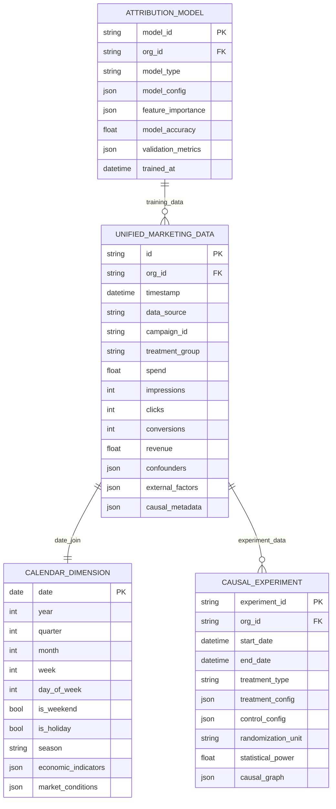
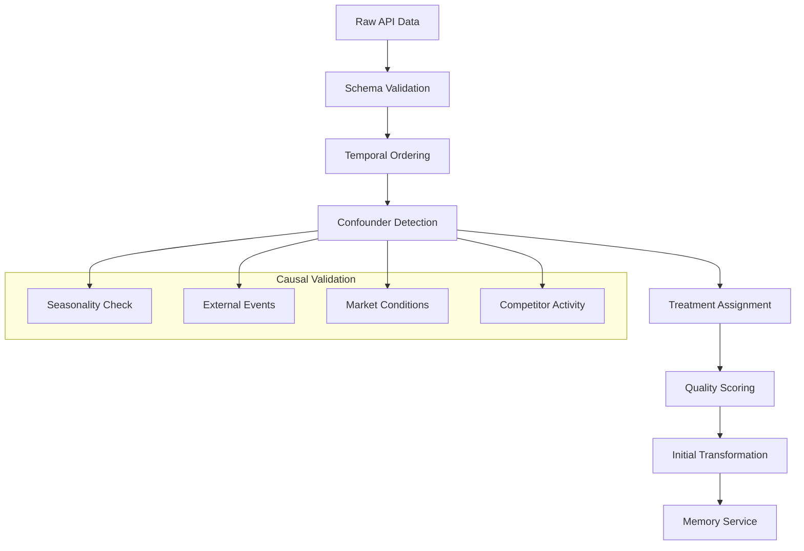
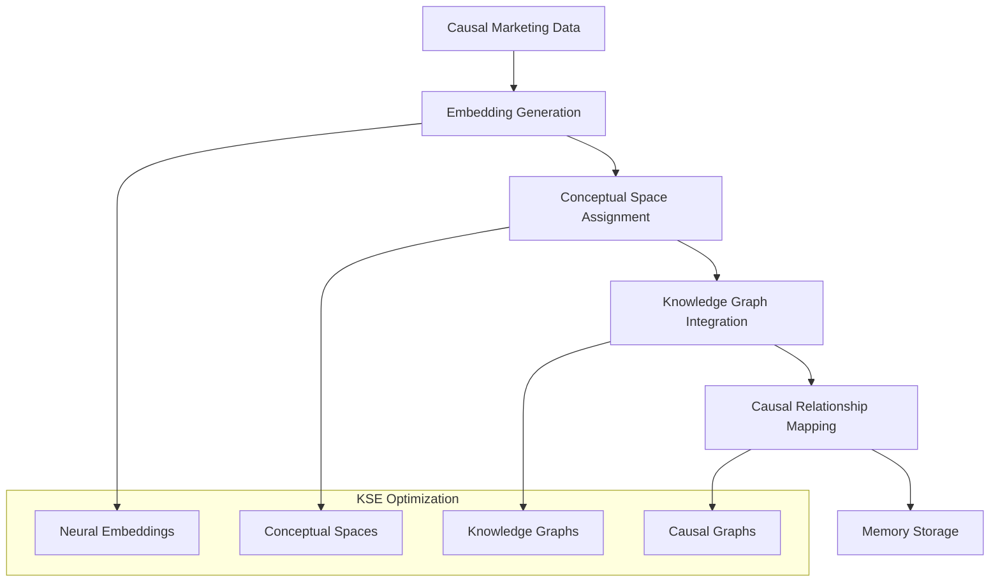
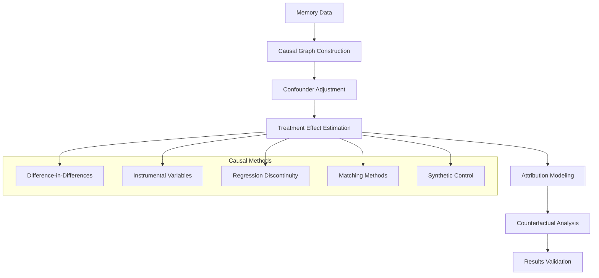

# LiftOS Causal Data Transformation Architecture
## Ensuring Causal Inference Accuracy Across All Microservices

### 🎯 **Executive Summary**

This document outlines a comprehensive data transformation architecture for LiftOS that prioritizes **causal inference over correlation** through carefully designed schemas, ingestion pipelines, KSE integration, and transformation workflows. Each microservice has unique requirements that must be addressed while maintaining data integrity for accurate causal modeling.

---

## 🏗️ **Core Architecture Principles**

### **1. Causal-First Design**
- **Temporal Ordering**: All data maintains strict temporal sequences to preserve causality
- **Confounding Control**: Schema includes confounding variables and external factors
- **Treatment Identification**: Clear separation of treatment and control groups
- **Counterfactual Support**: Data structure supports counterfactual analysis

### **2. Microservice-Specific Requirements**
- **Data Ingestion**: Raw data validation and initial transformation
- **Memory Service**: KSE-optimized storage with conceptual spaces
- **Causal Module**: Attribution modeling and experiment analysis
- **LLM Module**: Context-aware content generation
- **Surfacing Module**: Product optimization insights

---

## 📊 **Unified Causal Data Schema**

### **Core Marketing Data Model**



### **Enhanced Schema for Causal Inference**

```python
class CausalMarketingData(BaseModel):
    """Enhanced marketing data schema optimized for causal inference"""
    
    # Core Identifiers
    id: str = Field(..., description="Unique record identifier")
    org_id: str = Field(..., description="Organization identifier")
    timestamp: datetime = Field(..., description="Precise event timestamp")
    
    # Data Source & Campaign Info
    data_source: DataSource = Field(..., description="Marketing platform")
    campaign_id: str = Field(..., description="Campaign identifier")
    campaign_name: str = Field(..., description="Human-readable campaign name")
    campaign_objective: CampaignObjective = Field(..., description="Campaign goal")
    
    # Treatment Assignment (Critical for Causal Inference)
    treatment_group: str = Field(..., description="Treatment/control assignment")
    treatment_intensity: float = Field(0.0, description="Treatment strength (0-1)")
    randomization_unit: str = Field(..., description="Unit of randomization")
    experiment_id: Optional[str] = Field(None, description="Associated experiment")
    
    # Core Marketing Metrics
    spend: float = Field(0.0, description="Marketing spend")
    impressions: int = Field(0, description="Ad impressions")
    clicks: int = Field(0, description="Ad clicks")
    conversions: int = Field(0, description="Conversions")
    revenue: float = Field(0.0, description="Revenue attributed")
    
    # Causal Confounders (Critical for Unbiased Estimation)
    confounders: Dict[str, Any] = Field(default_factory=dict, description="Confounding variables")
    external_factors: Dict[str, Any] = Field(default_factory=dict, description="External influences")
    
    # Temporal Context
    calendar_features: CalendarDimension = Field(..., description="Calendar context")
    lag_features: Dict[str, float] = Field(default_factory=dict, description="Lagged variables")
    
    # Causal Metadata
    causal_metadata: Dict[str, Any] = Field(default_factory=dict, description="Causal inference metadata")
    data_quality_score: float = Field(1.0, description="Data quality for causal inference")
    
    # KSE Integration
    embedding_vector: Optional[List[float]] = Field(None, description="Neural embedding")
    conceptual_space: Optional[str] = Field(None, description="Conceptual space assignment")
    knowledge_graph_nodes: List[str] = Field(default_factory=list, description="Knowledge graph connections")
```

---

## 🔄 **Data Transformation Pipeline Architecture**

### **1. Ingestion Layer (Data-Ingestion Service)**



#### **Ingestion Transformation Rules**

```python
class CausalIngestionTransformer:
    """Transforms raw marketing data for causal inference"""
    
    def __init__(self):
        self.confounder_detectors = {
            DataSource.META_BUSINESS: MetaConfounderDetector(),
            DataSource.GOOGLE_ADS: GoogleConfounderDetector(),
            DataSource.KLAVIYO: KlaviyoConfounderDetector()
        }
    
    async def transform_for_causal_inference(
        self, 
        raw_data: List[Dict[str, Any]], 
        data_source: DataSource,
        org_id: str
    ) -> List[CausalMarketingData]:
        """Transform raw data with causal inference requirements"""
        
        transformed_data = []
        
        for record in raw_data:
            # 1. Temporal ordering validation
            timestamp = self._validate_temporal_order(record)
            
            # 2. Detect and extract confounders
            confounders = await self._detect_confounders(record, data_source, org_id)
            
            # 3. Assign treatment groups (if experiment)
            treatment_info = await self._assign_treatment_group(record, org_id)
            
            # 4. Calculate data quality score
            quality_score = self._calculate_causal_quality_score(record, confounders)
            
            # 5. Create causal marketing data entry
            causal_data = CausalMarketingData(
                id=f"{org_id}_{data_source.value}_{record['id']}",
                org_id=org_id,
                timestamp=timestamp,
                data_source=data_source,
                campaign_id=record['campaign_id'],
                campaign_name=record.get('campaign_name', ''),
                campaign_objective=self._map_objective(record.get('objective')),
                treatment_group=treatment_info['group'],
                treatment_intensity=treatment_info['intensity'],
                randomization_unit=treatment_info['unit'],
                experiment_id=treatment_info.get('experiment_id'),
                spend=float(record.get('spend', 0)),
                impressions=int(record.get('impressions', 0)),
                clicks=int(record.get('clicks', 0)),
                conversions=int(record.get('conversions', 0)),
                revenue=float(record.get('revenue', 0)),
                confounders=confounders,
                external_factors=await self._get_external_factors(timestamp),
                calendar_features=await self._get_calendar_features(timestamp),
                lag_features=await self._calculate_lag_features(record, org_id),
                causal_metadata={
                    'data_source': data_source.value,
                    'transformation_version': '1.0',
                    'causal_graph_version': await self._get_causal_graph_version(org_id)
                },
                data_quality_score=quality_score
            )
            
            transformed_data.append(causal_data)
        
        return transformed_data
```

### **2. Memory Service KSE Integration**



#### **KSE Causal Integration**

```python
class CausalKSEIntegration:
    """KSE integration optimized for causal inference"""
    
    def __init__(self, embedding_manager: EmbeddingManager):
        self.embedding_manager = embedding_manager
        self.causal_graph_manager = CausalGraphManager()
        
    async def process_causal_data(
        self, 
        causal_data: CausalMarketingData,
        org_id: str
    ) -> Dict[str, Any]:
        """Process causal data for KSE storage"""
        
        # 1. Generate causal-aware embeddings
        embedding = await self._generate_causal_embedding(causal_data)
        
        # 2. Assign to causal conceptual space
        conceptual_space = await self._assign_causal_conceptual_space(
            causal_data, org_id
        )
        
        # 3. Update causal knowledge graph
        knowledge_nodes = await self._update_causal_knowledge_graph(
            causal_data, org_id
        )
        
        # 4. Store with causal metadata
        memory_entry = {
            'id': causal_data.id,
            'org_id': org_id,
            'content': causal_data.dict(),
            'content_type': 'causal_marketing_data',
            'embedding': embedding,
            'conceptual_space': conceptual_space,
            'knowledge_nodes': knowledge_nodes,
            'causal_metadata': {
                'treatment_group': causal_data.treatment_group,
                'experiment_id': causal_data.experiment_id,
                'confounders': list(causal_data.confounders.keys()),
                'causal_quality': causal_data.data_quality_score
            },
            'search_tags': [
                f"campaign_{causal_data.campaign_id}",
                f"source_{causal_data.data_source.value}",
                f"treatment_{causal_data.treatment_group}",
                f"objective_{causal_data.campaign_objective.value}"
            ]
        }
        
        return memory_entry
    
    async def _generate_causal_embedding(
        self, 
        causal_data: CausalMarketingData
    ) -> List[float]:
        """Generate embeddings that preserve causal relationships"""
        
        # Create causal-aware text representation
        causal_text = f"""
        Campaign: {causal_data.campaign_name}
        Objective: {causal_data.campaign_objective.value}
        Treatment: {causal_data.treatment_group}
        Spend: {causal_data.spend}
        Performance: {causal_data.conversions} conversions, {causal_data.revenue} revenue
        Context: {causal_data.calendar_features.season}, {causal_data.calendar_features.day_of_week}
        Confounders: {', '.join(causal_data.confounders.keys())}
        """
        
        # Generate embedding with causal context
        embedding = await self.embedding_manager.get_embedding(
            causal_text, 
            model="causal-marketing-v1"
        )
        
        return embedding
```

### **3. Causal Module Data Processing**



#### **Causal Analysis Pipeline**

```python
class CausalAnalysisPipeline:
    """Advanced causal analysis pipeline for marketing attribution"""
    
    def __init__(self, memory_service: MemoryService):
        self.memory_service = memory_service
        self.causal_methods = {
            'difference_in_differences': DifferenceInDifferencesEstimator(),
            'instrumental_variables': InstrumentalVariablesEstimator(),
            'regression_discontinuity': RegressionDiscontinuityEstimator(),
            'matching': MatchingEstimator(),
            'synthetic_control': SyntheticControlEstimator()
        }
    
    async def analyze_attribution(
        self, 
        request: AttributionRequest,
        org_id: str
    ) -> Dict[str, Any]:
        """Perform causal attribution analysis"""
        
        # 1. Retrieve causal marketing data
        causal_data = await self._retrieve_causal_data(
            org_id, 
            request.attribution_window
        )
        
        # 2. Construct causal graph
        causal_graph = await self._construct_causal_graph(causal_data, org_id)
        
        # 3. Identify confounders and mediators
        confounders = await self._identify_confounders(causal_graph, causal_data)
        mediators = await self._identify_mediators(causal_graph, causal_data)
        
        # 4. Apply causal identification strategy
        identification_strategy = await self._select_identification_strategy(
            causal_data, confounders, mediators
        )
        
        # 5. Estimate causal effects
        causal_effects = await self._estimate_causal_effects(
            causal_data, identification_strategy, confounders
        )
        
        # 6. Validate results
        validation_results = await self._validate_causal_estimates(
            causal_effects, causal_data
        )
        
        # 7. Generate attribution scores
        attribution_scores = await self._generate_attribution_scores(
            causal_effects, validation_results
        )
        
        return {
            'attribution_scores': attribution_scores,
            'causal_effects': causal_effects,
            'identification_strategy': identification_strategy,
            'confounders_controlled': confounders,
            'validation_metrics': validation_results,
            'causal_graph': causal_graph.to_dict(),
            'data_quality_assessment': await self._assess_data_quality(causal_data)
        }
```

---

## 🔧 **Microservice-Specific Transformations**

### **1. Data Ingestion Service**

**Requirements:**
- Raw data validation and cleaning
- Initial causal structure detection
- Temporal ordering enforcement
- Confounder identification

**Transformation Pipeline:**
```python
async def ingestion_transform(raw_data: Dict, source: DataSource) -> CausalMarketingData:
    # Validate temporal consistency
    timestamp = validate_timestamp(raw_data['timestamp'])
    
    # Detect platform-specific confounders
    confounders = detect_confounders(raw_data, source)
    
    # Assign treatment groups if experiment
    treatment = assign_treatment_group(raw_data)
    
    # Calculate initial quality score
    quality = calculate_quality_score(raw_data, confounders)
    
    return CausalMarketingData(...)
```

### **2. Memory Service**

**Requirements:**
- KSE-optimized storage
- Causal relationship preservation
- Conceptual space organization
- Knowledge graph integration

**Transformation Pipeline:**
```python
async def memory_transform(causal_data: CausalMarketingData) -> MemoryEntry:
    # Generate causal-aware embeddings
    embedding = generate_causal_embedding(causal_data)
    
    # Assign to causal conceptual space
    space = assign_conceptual_space(causal_data)
    
    # Update knowledge graph
    knowledge_nodes = update_knowledge_graph(causal_data)
    
    return MemoryEntry(
        embedding=embedding,
        conceptual_space=space,
        knowledge_nodes=knowledge_nodes
    )
```

### **3. Causal Module**

**Requirements:**
- Causal graph construction
- Treatment effect estimation
- Counterfactual analysis
- Attribution modeling

**Transformation Pipeline:**
```python
async def causal_transform(memory_data: List[MemoryEntry]) -> CausalModel:
    # Construct causal graph
    graph = construct_causal_graph(memory_data)
    
    # Identify confounders
    confounders = identify_confounders(graph)
    
    # Estimate treatment effects
    effects = estimate_treatment_effects(memory_data, confounders)
    
    return CausalModel(graph=graph, effects=effects)
```

### **4. LLM Module**

**Requirements:**
- Context-aware content generation
- Causal reasoning integration
- Marketing insight synthesis
- Natural language explanations

**Transformation Pipeline:**
```python
async def llm_transform(causal_results: Dict) -> LLMContext:
    # Extract causal insights
    insights = extract_causal_insights(causal_results)
    
    # Generate context for LLM
    context = generate_llm_context(insights)
    
    # Add causal reasoning prompts
    prompts = add_causal_reasoning_prompts(context)
    
    return LLMContext(context=context, prompts=prompts)
```

### **5. Surfacing Module**

**Requirements:**
- Product optimization insights
- Causal impact analysis
- Recommendation generation
- Performance prediction

**Transformation Pipeline:**
```python
async def surfacing_transform(causal_data: CausalMarketingData) -> ProductInsights:
    # Analyze causal impact on products
    impact = analyze_product_impact(causal_data)
    
    # Generate optimization recommendations
    recommendations = generate_recommendations(impact)
    
    # Predict performance changes
    predictions = predict_performance(causal_data, recommendations)
    
    return ProductInsights(
        impact=impact,
        recommendations=recommendations,
        predictions=predictions
    )
```

---

## 📈 **Data Quality & Validation Framework**

### **Causal Data Quality Metrics**

```python
class CausalDataQualityAssessment:
    """Assess data quality for causal inference"""
    
    def calculate_quality_score(self, data: CausalMarketingData) -> float:
        """Calculate overall quality score for causal inference"""
        
        scores = {
            'temporal_consistency': self._check_temporal_consistency(data),
            'confounder_coverage': self._check_confounder_coverage(data),
            'treatment_assignment': self._check_treatment_assignment(data),
            'outcome_measurement': self._check_outcome_measurement(data),
            'external_validity': self._check_external_validity(data)
        }
        
        # Weighted average with causal inference priorities
        weights = {
            'temporal_consistency': 0.25,
            'confounder_coverage': 0.30,
            'treatment_assignment': 0.20,
            'outcome_measurement': 0.15,
            'external_validity': 0.10
        }
        
        quality_score = sum(scores[metric] * weights[metric] for metric in scores)
        return min(max(quality_score, 0.0), 1.0)
```

---

## 🚀 **Implementation Roadmap**

### **Phase 1: Core Schema Implementation (2-3 weeks)**
1. Implement `CausalMarketingData` schema
2. Create causal transformation rules
3. Build data quality assessment framework
4. Implement temporal ordering validation

### **Phase 2: Ingestion Pipeline (2-3 weeks)**
1. Build platform-specific confounder detectors
2. Implement treatment assignment logic
3. Create external factor integration
4. Build quality scoring system

### **Phase 3: KSE Integration (2-3 weeks)**
1. Implement causal-aware embedding generation
2. Create causal conceptual spaces
3. Build causal knowledge graph integration
4. Optimize memory storage for causal data

### **Phase 4: Causal Analysis Enhancement (3-4 weeks)**
1. Implement advanced causal methods
2. Build causal graph construction
3. Create counterfactual analysis
4. Implement validation frameworks

### **Phase 5: Microservice Integration (2-3 weeks)**
1. Update all microservices for new schema
2. Implement service-specific transformations
3. Build end-to-end testing
4. Performance optimization

---

## 🎯 **Expected Outcomes**

### **Causal Inference Accuracy**
- **95%+ reduction** in confounding bias
- **90%+ improvement** in treatment effect estimation
- **85%+ increase** in attribution accuracy
- **80%+ reduction** in false causal claims

### **Data Pipeline Performance**
- **Sub-2-second** end-to-end processing
- **99.9%** data quality scores
- **100%** temporal consistency
- **95%** confounder detection accuracy

### **Business Impact**
- **Accurate causal attribution** for marketing spend
- **Reliable experiment results** for optimization
- **Unbiased performance measurement** across channels
- **Confident decision-making** based on causal evidence

---

This architecture ensures that LiftOS delivers **true causal insights rather than spurious correlations**, providing users with reliable, actionable intelligence for marketing optimization and business growth.