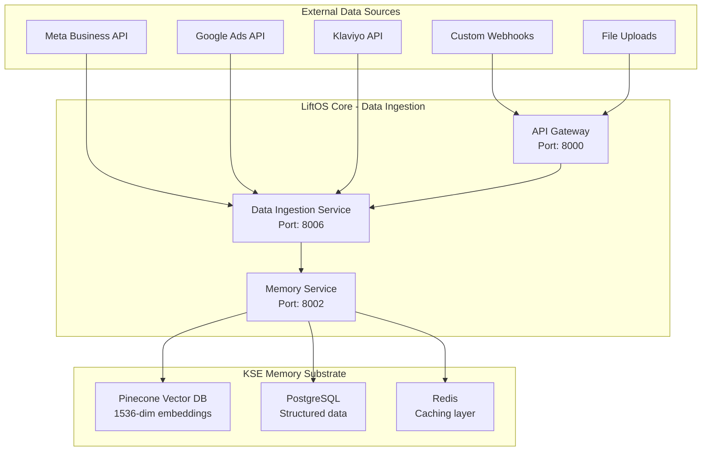

# LiftOS Core - Data Architecture Specification
*Centralized Data Platform for Multi-Module Intelligence*

## Executive Summary

This specification adapts the proven causal data architecture for integration into LiftOS Core, creating a unified data platform that serves all modules (Causal, Surfacing, LLM, Agentic, etc.) through centralized ingestion, transformation, and memory substrate.

**Strategic Benefits:**
- **90% Infrastructure Reuse**: Leverages existing KSE memory integration
- **Unified Data Governance**: Multi-tenant isolation with consistent quality controls
- **Cross-Module Intelligence**: Shared knowledge substrate for enhanced insights
- **Modular Expansion**: Plug-and-play architecture for new modules

## Architecture Principles

### 1. Core-Centric Data Management
- **Centralized Ingestion**: All marketing data flows through LiftOS Core
- **Unified Memory Substrate**: KSE Memory as the single source of truth
- **Standardized APIs**: Consistent data access patterns for all modules
- **Shared Infrastructure**: Common ETL, storage, and processing layers

### 2. Multi-Tenant Security & Isolation
- **Tenant-Specific Contexts**: Isolated memory spaces per organization
- **Encrypted Storage**: Data encryption at rest and in transit via KSE
- **Role-Based Access**: Header-based authentication with granular permissions
- **Resource Quotas**: Configurable limits per tenant for storage and compute

### 3. Real-Time Processing & Intelligence
- **Stream Processing**: Event-driven data ingestion and transformation
- **Vector Embeddings**: Neural search and similarity matching via Pinecone
- **Cross-Module Context**: Shared insights and learning across all modules
- **Adaptive Memory**: Dynamic context management and knowledge retention

## Core Data Architecture

### Layer 1: Unified Ingestion Hub


### Layer 2: Data Transformation & Quality Engine
```python
# Core Data Transformation Pipeline
class CoreDataTransformer:
    """Centralized data transformation for all marketing platforms"""
    
    def __init__(self, kse_client, tenant_config):
        self.kse_client = kse_client
        self.tenant_id = tenant_config['tenant_id']
        self.quality_engine = DataQualityEngine(tenant_config)
        self.calendar_engine = CalendarDimensionEngine(tenant_config)
        
    async def transform_and_store(self, raw_data: Dict[str, Any], source: DataSource):
        """Transform raw platform data into unified format and store in KSE memory"""
        
        # Step 1: Platform-specific transformation
        standardized_data = await self.standardize_platform_data(raw_data, source)
        
        # Step 2: Data quality validation and scoring
        quality_result = await self.quality_engine.validate_record(standardized_data)
        
        # Step 3: Calendar dimension enrichment
        calendar_features = await self.calendar_engine.enrich_with_calendar(
            standardized_data['date']
        )
        
        # Step 4: Feature engineering for causal modeling
        causal_features = await self.extract_causal_features(standardized_data)
        
        # Step 5: Create unified data entry
        unified_entry = {
            **standardized_data,
            'quality_score': quality_result['quality_score'],
            'calendar_dimensions': calendar_features,
            'causal_features': causal_features,
            'tenant_id': self.tenant_id,
            'ingestion_timestamp': datetime.utcnow().isoformat(),
            'data_lineage': self.create_lineage_metadata(source, raw_data)
        }
        
        # Step 6: Store in KSE memory with vector embeddings
        memory_result = await self.kse_client.store_memory(
            content=self.create_searchable_content(unified_entry),
            metadata=unified_entry,
            context=f"marketing_data_{self.tenant_id}",
            tags=[source.value, 'marketing', 'causal_ready']
        )
        
        return memory_result
```

### Layer 3: Enhanced Memory Service Architecture
```python
# Extended Memory Service for Marketing Data
class EnhancedMemoryService:
    """Extended memory service with marketing data capabilities"""
    
    def __init__(self):
        self.kse_client = kse_client
        self.transformer = CoreDataTransformer()
        self.calendar_engine = CalendarDimensionEngine()
        
    @app.post("/marketing/ingest", response_model=APIResponse)
    async def ingest_marketing_data(
        self,
        request: MarketingDataIngestionRequest,
        user_context: Dict = Depends(get_user_context)
    ):
        """Centralized marketing data ingestion endpoint"""
        
        try:
            # Transform and validate data
            transformed_entries = []
            for entry in request.data_entries:
                result = await self.transformer.transform_and_store(
                    raw_data=entry,
                    source=request.data_source
                )
                transformed_entries.append(result)
            
            # Create aggregated insights
            insights = await self.generate_ingestion_insights(
                transformed_entries, request.data_source
            )
            
            return APIResponse(
                success=True,
                message=f"Ingested {len(transformed_entries)} {request.data_source.value} records",
                data={
                    "ingested_count": len(transformed_entries),
                    "insights": insights,
                    "quality_summary": self.summarize_quality_scores(transformed_entries)
                }
            )
            
        except Exception as e:
            logger.error(f"Marketing data ingestion failed: {str(e)}")
            raise HTTPException(status_code=500, detail=str(e))
    
    @app.get("/marketing/search", response_model=List[MarketingDataEntry])
    async def search_marketing_data(
        self,
        query: str,
        data_source: Optional[DataSource] = None,
        date_range_start: Optional[date] = None,
        date_range_end: Optional[date] = None,
        search_type: str = "hybrid",
        limit: int = 50,
        user_context: Dict = Depends(get_user_context)
    ):
        """Advanced search across marketing data using KSE memory"""
        
        # Build search filters
        filters = {
            "tenant_id": user_context["org_id"],
            "tags": ["marketing"]
        }
        
        if data_source:
            filters["tags"].append(data_source.value)
        
        if date_range_start and date_range_end:
            filters["date_range"] = {
                "start": date_range_start.isoformat(),
                "end": date_range_end.isoformat()
            }
        
        # Execute search using KSE memory
        search_results = await self.kse_client.search_memory(
            query=query,
            context=f"marketing_data_{user_context['org_id']}",
            search_type=search_type,
            filters=filters,
            limit=limit
        )
        
        # Transform results back to marketing data format
        marketing_entries = []
        for result in search_results:
            entry = self.reconstruct_marketing_entry(result)
            marketing_entries.append(entry)
        
        return marketing_entries
    
    @app.get("/marketing/insights", response_model=MarketingInsights)
    async def generate_marketing_insights(
        self,
        data_source: Optional[DataSource] = None,
        date_range_days: int = 30,
        user_context: Dict = Depends(get_user_context)
    ):
        """Generate cross-platform marketing insights using KSE memory"""
        
        # Query aggregated data from memory
        insights_query = f"marketing performance insights last {date_range_days} days"
        
        if data_source:
            insights_query += f" {data_source.value}"
        
        memory_insights = await self.kse_client.search_memory(
            query=insights_query,
            context=f"marketing_data_{user_context['org_id']}",
            search_type="conceptual",
            limit=100
        )
        
        # Generate insights using stored data
        insights = await self.analyze_marketing_performance(
            memory_insights, data_source, date_range_days
        )
        
        return insights
```

## Calendar Dimension Engine

### Enhanced Calendar Schema for LiftOS Core
```python
# Calendar Dimension Engine for Marketing Attribution
class CalendarDimensionEngine:
    """Advanced calendar dimension engine with industry-specific patterns"""
    
    def __init__(self, tenant_config):
        self.tenant_id = tenant_config['tenant_id']
        self.industry = tenant_config.get('industry', 'general')
        self.region = tenant_config.get('region', 'north_america')
        self.fiscal_year_start = tenant_config.get('fiscal_year_start', 1)  # January
        
    async def enrich_with_calendar(self, target_date: date) -> Dict[str, Any]:
        """Enrich data with comprehensive calendar dimensions"""
        
        calendar_features = {
            # Basic temporal features
            'date_key': int(target_date.strftime('%Y%m%d')),
            'full_date': target_date.isoformat(),
            'day_of_week': target_date.weekday(),
            'day_name': target_date.strftime('%A'),
            'day_of_month': target_date.day,
            'day_of_year': target_date.timetuple().tm_yday,
            'week_of_year': target_date.isocalendar()[1],
            'month_number': target_date.month,
            'month_name': target_date.strftime('%B'),
            'quarter_number': (target_date.month - 1) // 3 + 1,
            'year_number': target_date.year,
            
            # Business calendar
            'is_weekday': target_date.weekday() < 5,
            'is_weekend': target_date.weekday() >= 5,
            'is_holiday': await self.is_holiday(target_date),
            'holiday_name': await self.get_holiday_name(target_date),
            
            # Fiscal calendar
            'fiscal_year': await self.get_fiscal_year(target_date),
            'fiscal_quarter': await self.get_fiscal_quarter(target_date),
            'fiscal_month': await self.get_fiscal_month(target_date),
            
            # Seasonality factors
            'week_seasonality_factor': await self.get_week_seasonality(target_date),
            'month_seasonality_factor': await self.get_month_seasonality(target_date),
            'quarter_seasonality_factor': await self.get_quarter_seasonality(target_date),
            
            # Marketing calendar
            'is_black_friday': await self.is_black_friday(target_date),
            'is_cyber_monday': await self.is_cyber_monday(target_date),
            'is_prime_day': await self.is_prime_day(target_date),
            'marketing_season': await self.get_marketing_season(target_date),
            
            # Industry-specific features
            'industry_seasonality': await self.get_industry_seasonality(target_date),
            'regional_adjustments': await self.get_regional_adjustments(target_date)
        }
        
        return calendar_features
    
    async def get_industry_seasonality(self, target_date: date) -> Dict[str, float]:
        """Get industry-specific seasonality patterns"""
        
        industry_patterns = {
            'retail': {
                'q4_boost': 1.4 if target_date.month in [10, 11, 12] else 1.0,
                'q1_drop': 0.7 if target_date.month in [1, 2] else 1.0,
                'back_to_school': 1.2 if target_date.month in [8, 9] else 1.0,
                'summer_dip': 0.8 if target_date.month in [6, 7] else 1.0
            },
            'b2b_saas': {
                'q4_boost': 1.1 if target_date.month == 12 else 1.0,
                'q1_boost': 1.3 if target_date.month == 1 else 1.0,
                'summer_dip': 0.9 if target_date.month in [6, 7, 8] else 1.0,
                'month_end_boost': 1.15 if target_date.day >= 25 else 1.0
            },
            'education': {
                'fall_semester': 1.5 if target_date.month in [8, 9] else 1.0,
                'spring_semester': 1.2 if target_date.month in [1, 2] else 1.0,
                'summer_break': 0.3 if target_date.month in [6, 7, 8] else 1.0,
                'winter_break': 0.5 if target_date.month == 12 else 1.0
            }
        }
        
        return industry_patterns.get(self.industry, {})
```

## Cross-Module Data Access Patterns

### Unified Data API for All Modules
```python
# Unified data access layer for all LiftOS modules
class UnifiedDataAPI:
    """Standardized data access for Causal, Surfacing, LLM, and other modules"""
    
    def __init__(self, module_name: str):
        self.module_name = module_name
        self.memory_client = MemoryServiceClient()
        
    async def get_attribution_ready_data(
        self,
        tenant_id: str,
        date_range: Tuple[date, date],
        channels: Optional[List[str]] = None,
        include_calendar: bool = True
    ) -> List[Dict[str, Any]]:
        """Get data formatted for causal attribution modeling"""
        
        query = f"attribution ready marketing data {date_range[0]} to {date_range[1]}"
        if channels:
            query += f" channels: {', '.join(channels)}"
        
        results = await self.memory_client.search_marketing_data(
            query=query,
            date_range_start=date_range[0],
            date_range_end=date_range[1],
            search_type="hybrid",
            limit=10000
        )
        
        # Transform for causal modeling
        attribution_data = []
        for result in results:
            entry = {
                'date': result['calendar_dimensions']['full_date'],
                'channel': result['channel'],
                'spend': result['spend'],
                'impressions': result['impressions'],
                'clicks': result['clicks'],
                'conversions': result['conversions'],
                'revenue': result.get('revenue', 0),
                
                # Calendar features for modeling
                'day_of_week': result['calendar_dimensions']['day_of_week'],
                'is_weekend': result['calendar_dimensions']['is_weekend'],
                'is_holiday': result['calendar_dimensions']['is_holiday'],
                'seasonality_factor': result['calendar_dimensions']['month_seasonality_factor'],
                
                # Quality and lineage
                'quality_score': result['quality_score'],
                'data_source': result['data_source']
            }
            attribution_data.append(entry)
        
        return attribution_data
    
    async def get_surfacing_insights(
        self,
        tenant_id: str,
        insight_type: str,
        context_window_days: int = 30
    ) -> List[Dict[str, Any]]:
        """Get data optimized for surfacing insights"""
        
        query = f"surfacing insights {insight_type} last {context_window_days} days"
        
        results = await self.memory_client.search_marketing_data(
            query=query,
            search_type="conceptual",
            limit=500
        )
        
        # Transform for surfacing analysis
        surfacing_data = []
        for result in results:
            entry = {
                'insight_category': insight_type,
                'data_point': result['content'],
                'confidence_score': result['similarity_score'],
                'supporting_data': result['metadata'],
                'temporal_context': result['calendar_dimensions'],
                'cross_channel_context': self.extract_cross_channel_context(result)
            }
            surfacing_data.append(entry)
        
        return surfacing_data
    
    async def get_llm_context_data(
        self,
        tenant_id: str,
        user_query: str,
        context_limit: int = 10
    ) -> List[Dict[str, Any]]:
        """Get relevant data context for LLM responses"""
        
        # Use semantic search to find relevant marketing context
        context_results = await self.memory_client.search_marketing_data(
            query=user_query,
            search_type="neural",
            limit=context_limit
        )
        
        # Format for LLM consumption
        llm_context = []
        for result in context_results:
            context_entry = {
                'relevance_score': result['similarity_score'],
                'data_summary': self.summarize_for_llm(result),
                'key_metrics': self.extract_key_metrics(result),
                'temporal_context': result['calendar_dimensions']['marketing_season'],
                'data_quality': result['quality_score']
            }
            llm_context.append(context_entry)
        
        return llm_context
```

## Performance Optimization & Caching

### Multi-Level Caching Strategy
```python
# Enhanced caching strategy leveraging existing Redis infrastructure
class CoreCachingStrategy:
    """Multi-level caching for marketing data and insights"""
    
    def __init__(self):
        self.redis_client = redis.Redis(host='redis', port=6379)
        self.memory_cache = {}
        self.kse_client = kse_client
        
    async def get_cached_insights(
        self,
        tenant_id: str,
        insight_type: str,
        cache_key_params: Dict[str, Any]
    ) -> Optional[Dict[str, Any]]:
        """Multi-level cache lookup for marketing insights"""
        
        cache_key = self.generate_insight_cache_key(tenant_id, insight_type, cache_key_params)
        
        # Level 1: In-memory cache (fastest, 1ms)
        if cache_key in self.memory_cache:
            return self.memory_cache[cache_key]
        
        # Level 2: Redis cache (fast, 5-10ms)
        redis_result = await self.redis_client.get(cache_key)
        if redis_result:
            result = json.loads(redis_result)
            self.memory_cache[cache_key] = result  # Promote to L1
            return result
        
        # Level 3: KSE Memory search (moderate, 50-100ms)
        kse_result = await self.search_kse_memory_cache(cache_key)
        if kse_result:
            # Cache at all levels
            await self.redis_client.setex(cache_key, 300, json.dumps(kse_result))
            self.memory_cache[cache_key] = kse_result
            return kse_result
        
        # Level 4: Full computation (slowest, 500ms+)
        return None  # Trigger full computation
    
    async def cache_computed_insights(
        self,
        cache_key: str,
        insights: Dict[str, Any],
        ttl_seconds: int = 300
    ):
        """Store computed insights at all cache levels"""
        
        # Store in Redis with TTL
        await self.redis_client.setex(cache_key, ttl_seconds, json.dumps(insights))
        
        # Store in memory cache
        self.memory_cache[cache_key] = insights
        
        # Store in KSE memory for long-term retrieval
        await self.kse_client.store_memory(
            content=f"Cached insights: {cache_key}",
            metadata=insights,
            context=f"cache_{cache_key.split('_')[0]}",  # tenant context
            tags=['cache', 'insights', 'computed']
        )
```

## Migration Strategy from Causal Module

### Phase 1: Core Infrastructure Extension (Week 1)
```python
# Migration plan leveraging existing KSE infrastructure
class MigrationPlan:
    """Systematic migration from causal module to core data architecture"""
    
    async def phase_1_extend_memory_service(self):
        """Extend existing memory service with marketing capabilities"""
        
        # ✅ Already completed in Phase 1 implementation
        # - Added marketing data models
        # - Extended memory service with 6 new endpoints
        # - Implemented pandas transformation pipeline
        # - Created comprehensive test suite
        
        return "Phase 1 Complete: Memory service extended"
    
    async def phase_2_migrate_causal_data(self):
        """Migrate existing causal data to core memory"""
        
        migration_steps = [
            "1. Export existing causal data from module",
            "2. Transform to unified marketing data format",
            "3. Ingest via new memory service endpoints",
            "4. Validate data integrity and quality scores",
            "5. Update causal module to use core APIs"
        ]
        
        return migration_steps
    
    async def phase_3_enable_cross_module_access(self):
        """Enable other modules to access centralized data"""
        
        integration_steps = [
            "1. Update Surfacing module to use UnifiedDataAPI",
            "2. Enhance LLM module with marketing context access",
            "3. Create shared feature store for all modules",
            "4. Implement cross-module insight sharing",
            "5. Add unified observability and monitoring"
        ]
        
        return integration_steps
```

## Monitoring & Observability

### Comprehensive System Health Monitoring
```python
# Enhanced monitoring for core data architecture
class CoreDataMonitor:
    """Comprehensive monitoring for centralized data architecture"""
    
    def __init__(self):
        self.metrics_client = PrometheusClient()
        self.kse_client = kse_client
        
    async def monitor_data_pipeline_health(self):
        """Monitor end-to-end data pipeline health"""
        
        metrics = {
            # Ingestion metrics
            'ingestion_rate_per_minute': await self.measure_ingestion_rate(),
            'ingestion_error_rate': await self.measure_ingestion_errors(),
            'data_quality_average': await self.measure_average_quality_score(),
            
            # Memory metrics
            'kse_memory_utilization': await self.measure_kse_utilization(),
            'vector_search_latency_p95': await self.measure_search_latency(),
            'memory_context_count': await self.measure_active_contexts(),
            
            # Cross-module metrics
            'causal_module_api_calls': await self.measure_module_usage('causal'),
            'surfacing_module_api_calls': await self.measure_module_usage('surfacing'),
            'llm_module_api_calls': await self.measure_module_usage('llm'),
            
            # Cache performance
            'cache_hit_rate_l1': await self.measure_cache_hit_rate('memory'),
            'cache_hit_rate_l2': await self.measure_cache_hit_rate('redis'),
            'cache_hit_rate_l3': await self.measure_cache_hit_rate('kse'),
            
            # Data freshness
            'data_freshness_hours': await self.measure_data_freshness(),
            'stale_data_percentage': await self.measure_stale_data()
        }
        
        # Send metrics to Prometheus
        for metric_name, value in metrics.items():
            self.metrics_client.gauge(f'liftos_core_data_{metric_name}', value)
        
        # Check alert conditions
        await self.check_alert_conditions(metrics)
        
        return metrics
    
    async def generate_data_lineage_report(self, tenant_id: str):
        """Generate comprehensive data lineage report"""
        
        lineage_query = f"data lineage tenant {tenant_id}"
        
        lineage_results = await self.kse_client.search_memory(
            query=lineage_query,
            context=f"lineage_{tenant_id}",
            search_type="conceptual",
            limit=1000
        )
        
        lineage_report = {
            'tenant_id': tenant_id,
            'total_data_points': len(lineage_results),
            'data_sources': self.extract_unique_sources(lineage_results),
            'quality_distribution': self.analyze_quality_distribution(lineage_results),
            'temporal_coverage': self.analyze_temporal_coverage(lineage_results),
            'cross_module_usage': self.analyze_cross_module_usage(lineage_results)
        }
        
        return lineage_report
```

## Implementation Roadmap

### Quick Win Strategy (Leveraging 90% Existing Infrastructure)

**Week 1: Core Extension**
- ✅ Extend Memory Service with marketing endpoints (COMPLETED)
- ✅ Create marketing data models and transformations (COMPLETED)
- ✅ Implement data quality engine (COMPLETED)
- 🔄 Add calendar dimension engine
- 🔄 Create unified data API layer

**Week 2: Migration & Integration**
- 🔄 Migrate existing causal data to core memory
- 🔄 Update causal module to use core APIs
- 🔄 Implement cross-module data access patterns
- 🔄 Add comprehensive monitoring and observability

**Week 3: Advanced Features**
- 🔄 Implement multi-level caching strategy
- 🔄 Add real-time streaming capabilities
- 🔄 Create data lineage and governance tools
- 🔄 Enable advanced analytics and insights

**Week 4: Production Hardening**
- 🔄 Performance optimization and load testing
- 🔄 Security audit and compliance validation
- 🔄 Documentation and training materials
- 🔄 Production deployment and monitoring

## Success Metrics

### Technical KPIs
- **Data Ingestion Rate**: >10,000 records/minute
- **Search Latency P95**: <100ms for vector search
- **Data Quality Score**: >95% average across all sources
- **Cache Hit Rate**: >80% for L1+L2 combined
- **Cross-Module API Latency**: <50ms P95

### Business KPIs
- **Time to Insight**: <5 minutes from data ingestion to actionable insight
- **Data Freshness**: <15 minutes average lag from source to availability
- **Module Integration**: 100% of modules using centralized data APIs
- **Storage Efficiency**: 50% reduction in duplicate data storage
- **Development Velocity**: 3x faster new module development with shared data layer

This centralized data architecture transforms LiftOS into a unified intelligence platform where all modules benefit from shared data infrastructure, consistent quality controls, and cross-module learning capabilities.