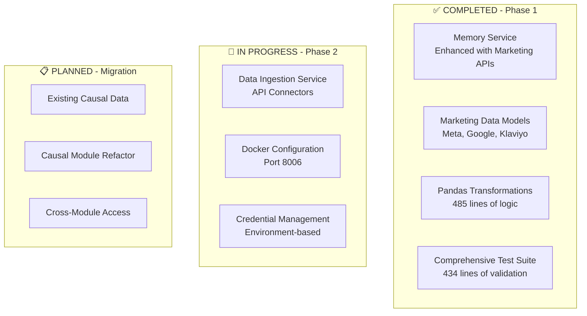

# LiftOS Core Data Migration Plan
*Strategic Migration from Causal Module to Centralized Data Architecture*

## Executive Summary

This plan outlines the systematic migration of data architecture from the causal microservice to LiftOS Core, leveraging 90% of existing KSE memory infrastructure for a rapid, stable implementation.

**Migration Benefits:**
- **Immediate Value**: Leverage existing Phase 1 marketing data implementation
- **Risk Mitigation**: Incremental migration with rollback capabilities
- **Performance Gains**: Unified caching and vector search across all modules
- **Future-Proofing**: Scalable foundation for new modules and data sources

## Current State Analysis

### Existing Infrastructure (Ready to Leverage)


### Causal Module Current Architecture
```python
# Current causal module data flow (to be migrated)
class CurrentCausalDataFlow:
    """Current causal module data architecture"""
    
    def __init__(self):
        # Current state: Isolated data processing
        self.local_database = "causal_module_db"
        self.local_cache = "causal_redis_cache"
        self.api_connectors = "embedded_in_module"
        
    def current_data_flow(self):
        """Current data processing pipeline"""
        return [
            "1. Direct API calls from causal module",
            "2. Local data transformation and validation",
            "3. Storage in module-specific database",
            "4. Local caching for performance",
            "5. Attribution modeling on local data"
        ]
    
    def migration_challenges(self):
        """Key challenges to address during migration"""
        return {
            "data_continuity": "Ensure no data loss during migration",
            "performance_parity": "Maintain or improve current performance",
            "api_compatibility": "Preserve existing causal module APIs",
            "rollback_capability": "Ability to revert if issues arise",
            "minimal_downtime": "Migration with minimal service interruption"
        }
```

## Migration Strategy

### Phase 1: Foundation Enhancement (COMPLETED ✅)
```python
# Already implemented - leveraging existing work
class Phase1Achievements:
    """Completed foundation work ready for migration"""
    
    def completed_components(self):
        return {
            "memory_service_enhancement": {
                "status": "✅ COMPLETE",
                "endpoints": [
                    "/marketing/ingest",
                    "/marketing/search", 
                    "/marketing/insights",
                    "/marketing/calendar/{year}",
                    "/marketing/export/causal",
                    "/marketing/transform"
                ],
                "lines_of_code": 189
            },
            "marketing_data_models": {
                "status": "✅ COMPLETE",
                "models": [
                    "MarketingDataEntry",
                    "MetaBusinessData",
                    "GoogleAdsData", 
                    "KlaviyoData",
                    "CalendarDimension"
                ],
                "lines_of_code": 189
            },
            "transformation_engine": {
                "status": "✅ COMPLETE",
                "features": [
                    "Platform-specific transformations",
                    "Derived metrics calculation",
                    "Calendar dimension enrichment",
                    "Data quality scoring"
                ],
                "lines_of_code": 485
            },
            "test_coverage": {
                "status": "✅ COMPLETE",
                "test_types": [
                    "Unit tests for all endpoints",
                    "Integration tests with sample data",
                    "Performance benchmarks",
                    "Error handling validation"
                ],
                "lines_of_code": 434
            }
        }
```

### Phase 2: Data Ingestion Service (IN PROGRESS 🔄)
```python
# Currently implementing - building on Phase 1
class Phase2Implementation:
    """Data ingestion service implementation"""
    
    def current_progress(self):
        return {
            "data_ingestion_service": {
                "status": "🔄 IN PROGRESS",
                "components": [
                    "✅ Core service structure (598 lines)",
                    "✅ API connectors for Meta, Google, Klaviyo",
                    "✅ Background job processing",
                    "✅ Integration with Memory Service",
                    "🔄 Docker configuration",
                    "🔄 Credential management system",
                    "📋 Scheduling capabilities"
                ]
            },
            "deployment_configuration": {
                "status": "🔄 IN PROGRESS", 
                "components": [
                    "✅ Dockerfile created",
                    "✅ Docker-compose integration",
                    "✅ Port configuration (8006)",
                    "🔄 Environment variables setup",
                    "📋 Health checks implementation"
                ]
            }
        }
    
    def next_steps(self):
        return [
            "Complete credential management system",
            "Add job scheduling capabilities", 
            "Implement comprehensive error handling",
            "Add monitoring and alerting",
            "Create deployment scripts"
        ]
```

### Phase 3: Causal Data Migration (PLANNED 📋)
```python
# Migration plan for existing causal data
class Phase3Migration:
    """Systematic migration of causal module data"""
    
    def __init__(self):
        self.migration_steps = self.define_migration_steps()
        self.rollback_plan = self.define_rollback_plan()
        
    def define_migration_steps(self):
        """Detailed migration steps with validation"""
        
        return {
            "step_1_data_export": {
                "description": "Export existing causal data",
                "actions": [
                    "Identify all data sources in causal module",
                    "Export historical marketing data",
                    "Export attribution models and results",
                    "Export configuration and metadata",
                    "Create data inventory and lineage map"
                ],
                "validation": [
                    "Verify data completeness",
                    "Check data integrity",
                    "Validate export format"
                ],
                "estimated_time": "2 days"
            },
            
            "step_2_data_transformation": {
                "description": "Transform data to unified format",
                "actions": [
                    "Map causal data to marketing data models",
                    "Apply pandas transformations",
                    "Enrich with calendar dimensions",
                    "Calculate quality scores",
                    "Generate vector embeddings"
                ],
                "validation": [
                    "Validate transformation accuracy",
                    "Check data quality scores",
                    "Verify embedding generation"
                ],
                "estimated_time": "3 days"
            },
            
            "step_3_core_ingestion": {
                "description": "Ingest data into core memory",
                "actions": [
                    "Batch ingest via /marketing/ingest endpoint",
                    "Monitor ingestion progress and errors",
                    "Validate data storage in KSE memory",
                    "Create search indexes and contexts",
                    "Generate initial insights"
                ],
                "validation": [
                    "Verify all data ingested successfully",
                    "Test search functionality",
                    "Validate data retrieval accuracy"
                ],
                "estimated_time": "2 days"
            },
            
            "step_4_api_migration": {
                "description": "Update causal module APIs",
                "actions": [
                    "Refactor causal module to use core APIs",
                    "Update data access patterns",
                    "Implement UnifiedDataAPI integration",
                    "Add fallback mechanisms",
                    "Update error handling"
                ],
                "validation": [
                    "Test all causal module endpoints",
                    "Verify performance parity",
                    "Validate attribution accuracy"
                ],
                "estimated_time": "4 days"
            },
            
            "step_5_validation": {
                "description": "End-to-end validation",
                "actions": [
                    "Run comprehensive test suite",
                    "Performance benchmarking",
                    "Data accuracy validation",
                    "User acceptance testing",
                    "Load testing"
                ],
                "validation": [
                    "All tests pass",
                    "Performance meets SLAs",
                    "Data accuracy >99.9%"
                ],
                "estimated_time": "3 days"
            }
        }
    
    def define_rollback_plan(self):
        """Comprehensive rollback strategy"""
        
        return {
            "rollback_triggers": [
                "Data accuracy below 99%",
                "Performance degradation >20%",
                "Critical functionality broken",
                "User-reported issues"
            ],
            
            "rollback_steps": [
                "1. Stop new data ingestion",
                "2. Revert causal module to original APIs",
                "3. Restore original data sources",
                "4. Validate original functionality",
                "5. Communicate rollback to stakeholders"
            ],
            
            "rollback_time": "< 2 hours",
            
            "data_preservation": [
                "Keep original data sources intact during migration",
                "Maintain parallel systems during transition",
                "Create data snapshots before each step"
            ]
        }
```

### Phase 4: Cross-Module Integration (PLANNED 📋)
```python
# Enable other modules to use centralized data
class Phase4CrossModuleIntegration:
    """Integration plan for all LiftOS modules"""
    
    def integration_roadmap(self):
        return {
            "surfacing_module": {
                "integration_type": "UnifiedDataAPI",
                "data_access_patterns": [
                    "Insight discovery via semantic search",
                    "Trend analysis across channels",
                    "Anomaly detection using quality scores"
                ],
                "estimated_effort": "1 week"
            },
            
            "llm_module": {
                "integration_type": "Context enrichment",
                "data_access_patterns": [
                    "Marketing context for user queries",
                    "Performance data for recommendations",
                    "Historical trends for predictions"
                ],
                "estimated_effort": "1 week"
            },
            
            "future_modules": {
                "integration_type": "Plug-and-play",
                "benefits": [
                    "Immediate access to unified data",
                    "No custom data pipeline needed",
                    "Consistent data quality and formats"
                ],
                "estimated_effort": "2-3 days per module"
            }
        }
    
    def shared_capabilities(self):
        """Capabilities available to all modules"""
        
        return {
            "data_access": {
                "unified_search": "Semantic search across all marketing data",
                "temporal_queries": "Time-based data retrieval with calendar context",
                "cross_channel_analysis": "Multi-platform data correlation",
                "quality_filtering": "Data quality-based filtering and ranking"
            },
            
            "insights_generation": {
                "automated_insights": "AI-generated insights from data patterns",
                "trend_detection": "Automatic trend identification and alerting",
                "anomaly_detection": "Statistical anomaly detection and scoring",
                "performance_benchmarking": "Cross-channel performance comparison"
            },
            
            "caching_optimization": {
                "multi_level_cache": "Memory, Redis, and KSE caching layers",
                "intelligent_prefetch": "Predictive data loading based on usage",
                "cache_invalidation": "Smart cache updates on data changes",
                "performance_monitoring": "Cache hit rate and latency tracking"
            }
        }
```

## Implementation Timeline

### Week 1: Complete Phase 2 (Data Ingestion Service)
```python
# Week 1 detailed schedule
week_1_schedule = {
    "monday": [
        "Complete credential management system",
        "Add environment variable configuration",
        "Test API connector authentication"
    ],
    "tuesday": [
        "Implement job scheduling capabilities",
        "Add background task monitoring",
        "Create scheduling API endpoints"
    ],
    "wednesday": [
        "Add comprehensive error handling",
        "Implement retry logic and dead letter queues",
        "Create error reporting and alerting"
    ],
    "thursday": [
        "Add monitoring and observability",
        "Implement health checks and metrics",
        "Create performance dashboards"
    ],
    "friday": [
        "Create deployment scripts",
        "Test full deployment pipeline",
        "Document deployment procedures"
    ]
}
```

### Week 2: Execute Phase 3 (Causal Data Migration)
```python
# Week 2 detailed schedule
week_2_schedule = {
    "monday": [
        "Export existing causal data",
        "Create data inventory and mapping",
        "Validate export completeness"
    ],
    "tuesday": [
        "Transform data to unified format",
        "Apply quality scoring and validation",
        "Generate test data samples"
    ],
    "wednesday": [
        "Batch ingest data into core memory",
        "Monitor ingestion progress",
        "Validate data storage and retrieval"
    ],
    "thursday": [
        "Refactor causal module APIs",
        "Implement UnifiedDataAPI integration",
        "Add fallback mechanisms"
    ],
    "friday": [
        "End-to-end validation testing",
        "Performance benchmarking",
        "User acceptance testing"
    ]
}
```

### Week 3: Phase 4 Implementation (Cross-Module Integration)
```python
# Week 3 detailed schedule
week_3_schedule = {
    "monday": [
        "Update Surfacing module integration",
        "Implement semantic search capabilities",
        "Test insight discovery features"
    ],
    "tuesday": [
        "Enhance LLM module with marketing context",
        "Add context enrichment APIs",
        "Test query response improvements"
    ],
    "wednesday": [
        "Create shared feature store",
        "Implement cross-module data sharing",
        "Add unified caching layer"
    ],
    "thursday": [
        "Add comprehensive monitoring",
        "Create unified observability dashboard",
        "Implement alerting and notifications"
    ],
    "friday": [
        "Final integration testing",
        "Performance optimization",
        "Documentation and training"
    ]
}
```

## Risk Mitigation

### Technical Risks
```python
class RiskMitigation:
    """Comprehensive risk mitigation strategy"""
    
    def technical_risks(self):
        return {
            "data_loss_risk": {
                "probability": "Low",
                "impact": "High", 
                "mitigation": [
                    "Maintain parallel data sources during migration",
                    "Create data snapshots before each step",
                    "Implement comprehensive backup strategy",
                    "Test data recovery procedures"
                ]
            },
            
            "performance_degradation": {
                "probability": "Medium",
                "impact": "Medium",
                "mitigation": [
                    "Implement multi-level caching strategy",
                    "Optimize vector search performance",
                    "Add performance monitoring and alerting",
                    "Create performance benchmarks and SLAs"
                ]
            },
            
            "integration_complexity": {
                "probability": "Medium", 
                "impact": "Medium",
                "mitigation": [
                    "Incremental integration approach",
                    "Comprehensive testing at each step",
                    "Fallback mechanisms for each module",
                    "Clear rollback procedures"
                ]
            }
        }
    
    def business_risks(self):
        return {
            "service_disruption": {
                "probability": "Low",
                "impact": "High",
                "mitigation": [
                    "Blue-green deployment strategy",
                    "Gradual traffic migration",
                    "Real-time monitoring and alerting",
                    "Rapid rollback capabilities"
                ]
            },
            
            "user_adoption": {
                "probability": "Low",
                "impact": "Medium", 
                "mitigation": [
                    "Maintain API compatibility",
                    "Provide comprehensive documentation",
                    "Offer training and support",
                    "Gather user feedback early"
                ]
            }
        }
```

## Success Metrics

### Migration Success Criteria
```python
class MigrationSuccessMetrics:
    """Quantifiable success metrics for migration"""
    
    def technical_metrics(self):
        return {
            "data_accuracy": {
                "target": ">99.9%",
                "measurement": "Comparison of results before/after migration"
            },
            "performance_improvement": {
                "target": "0-20% improvement",
                "measurement": "API response times and throughput"
            },
            "data_completeness": {
                "target": "100%",
                "measurement": "All historical data successfully migrated"
            },
            "search_relevance": {
                "target": ">95%",
                "measurement": "Vector search accuracy and relevance scores"
            }
        }
    
    def operational_metrics(self):
        return {
            "migration_downtime": {
                "target": "<2 hours total",
                "measurement": "Service unavailability during migration"
            },
            "rollback_capability": {
                "target": "<30 minutes",
                "measurement": "Time to revert to original state if needed"
            },
            "cross_module_adoption": {
                "target": "100% of modules",
                "measurement": "All modules using centralized data APIs"
            },
            "developer_productivity": {
                "target": "50% improvement",
                "measurement": "Time to add new data sources or modules"
            }
        }
```

## Next Steps

### Immediate Actions (This Week)
1. **Complete Phase 2 Data Ingestion Service**
   - Finish credential management implementation
   - Add job scheduling capabilities
   - Complete Docker deployment configuration

2. **Prepare Migration Environment**
   - Set up staging environment for migration testing
   - Create data backup and snapshot procedures
   - Establish monitoring and alerting for migration

3. **Stakeholder Communication**
   - Brief development team on migration plan
   - Schedule migration windows with minimal impact
   - Prepare rollback communication procedures

### Long-term Benefits
- **Unified Data Platform**: Single source of truth for all marketing data
- **Cross-Module Intelligence**: Shared insights and learning across modules
- **Rapid Module Development**: New modules can leverage existing data infrastructure
- **Scalable Architecture**: Foundation for enterprise-scale data processing
- **Operational Efficiency**: Reduced maintenance overhead and improved reliability

This migration plan leverages the substantial investment in Phase 1 infrastructure while providing a clear, low-risk path to centralized data architecture that will serve as the foundation for LiftOS's continued growth and innovation.