# LiftOS KSE Memory Integration - Reuse Analysis

## Executive Summary

**Excellent news!** The extensive KSE memory integration work provides a robust foundation for centralized data ingestion. We can leverage 90% of existing infrastructure for a quick, stable implementation.

## 🎯 **What We Can Reuse (Massive Value)**

### **1. Complete KSE Memory Infrastructure ✅**
- **Pinecone Integration**: Fully operational with `liftos-core-9td1bq3.svc.aped-4627-b74a.pinecone.io`
- **Vector Storage**: 1536-dimension embeddings with truncation handling
- **Authentication**: User context headers (`x-user-id`, `x-org-id`) already implemented
- **Health Checks**: Comprehensive monitoring and readiness probes
- **Docker Deployment**: Production-ready containerization

### **2. Robust API Endpoints ✅**
- **`/store`**: Ready for marketing data ingestion
- **`/search`**: Multiple search types (neural, conceptual, knowledge)
- **`/search/hybrid`**: Advanced search capabilities
- **Error Handling**: Comprehensive exception management
- **Logging**: Memory operation tracking and analytics

### **3. Microservice Architecture ✅**
- **Service Discovery**: All services registered and communicating
- **Port Allocation**: Clean port mapping (Memory: 8003)
- **Cross-Service Communication**: Validated integration patterns
- **Load Balancing**: Gateway routing configured

### **4. Data Models & SDK ✅**
- **`MemoryStoreRequest`**: Ready for marketing data structure
- **`MemorySearchRequest`**: Flexible query interface
- **`LiftKSEClient`**: Abstraction layer for Pinecone operations
- **Organization Context**: Multi-tenant memory isolation

## 🚀 **Quick Implementation Strategy**

### **Phase 1: Extend Memory Service (2-3 days)**
```python
# Add marketing data ingestion endpoints to existing memory service
@app.post("/ingest/marketing", response_model=APIResponse)
async def ingest_marketing_data(
    request: MarketingDataRequest,
    user_context: Dict = Depends(get_user_context)
):
    """Ingest Meta/Google/Klaviyo data into KSE memory"""
    # Leverage existing store_memory() function
    # Add marketing-specific data transformation
    # Use existing vector embedding pipeline
```

### **Phase 2: Marketing Data Models (1 day)**
```python
# Extend existing models in shared/models/base.py
class MarketingDataRequest(BaseModel):
    source: str  # "meta", "google", "klaviyo"
    data_type: str  # "campaigns", "audiences", "keywords"
    raw_data: Dict[str, Any]
    metadata: Optional[Dict[str, Any]] = None
```

### **Phase 3: API Connectors (3-4 days)**
```python
# Create new service: services/data-ingestion/
# Reuse existing Docker patterns and health checks
# Connect to existing Memory Service endpoints
```

## 🔧 **Minimal Changes Required**

### **Memory Service Extensions**
1. **Add marketing data endpoints** (4 new routes)
2. **Extend data models** for marketing schemas
3. **Add data transformation** for Meta/Google/Klaviyo formats
4. **Enhance search filters** for marketing-specific queries

### **New Data Ingestion Service**
1. **API Connectors**: Meta Business API, Google Ads API, Klaviyo API
2. **ETL Pipeline**: Transform → Validate → Store via Memory Service
3. **Scheduling**: Cron jobs for periodic data sync
4. **Error Recovery**: Retry logic and dead letter queues

### **Streamlit Integration**
1. **Update API Client** to use Memory Service instead of direct APIs
2. **Add data sync controls** in Settings page
3. **Enhance search interface** to query KSE memory

## 📊 **Architecture Diagram**

```mermaid
graph TB
    subgraph "External APIs"
        META[Meta Business API]
        GOOGLE[Google Ads API]
        KLAVIYO[Klaviyo API]
    end
    
    subgraph "New Component"
        INGESTION[Data Ingestion Service<br/>Port: 8010]
    end
    
    subgraph "Existing LiftOS Core"
        MEMORY[Memory Service<br/>Port: 8003<br/>✅ READY]
        KSE[KSE Memory SDK<br/>✅ OPERATIONAL]
        PINECONE[Pinecone Vector DB<br/>✅ CONFIGURED]
        CAUSAL[Causal Service<br/>Port: 8008]
        LLM[LLM Service<br/>Port: 8009]
    end
    
    subgraph "Frontend"
        STREAMLIT[Streamlit Hub<br/>✅ WORKING]
    end
    
    META --> INGESTION
    GOOGLE --> INGESTION
    KLAVIYO --> INGESTION
    
    INGESTION --> MEMORY
    MEMORY --> KSE
    KSE --> PINECONE
    
    MEMORY --> CAUSAL
    MEMORY --> LLM
    
    CAUSAL --> STREAMLIT
    LLM --> STREAMLIT
    MEMORY --> STREAMLIT
```



## 💰 **Resource Efficiency Analysis**

### **Reused Infrastructure (90%)**
- ✅ **KSE Memory Service**: $0 additional development
- ✅ **Pinecone Integration**: $0 additional setup
- ✅ **Docker Orchestration**: $0 additional configuration
- ✅ **Authentication System**: $0 additional security work
- ✅ **Health Monitoring**: $0 additional observability

### **New Development Required (10%)**
- 🔨 **Data Ingestion Service**: 3-4 days development
- 🔨 **Marketing Data Models**: 1 day modeling
- 🔨 **API Connectors**: 2-3 days integration
- 🔨 **Streamlit Updates**: 1-2 days frontend changes

### **Total Implementation Time: 7-10 days vs 30+ days from scratch**

## 🎯 **Immediate Next Steps**

### **Step 1: Validate Current Memory Service (30 minutes)**
```bash
# Test existing endpoints
curl -X POST http://localhost:8003/store \
  -H "x-user-id: demo-user" \
  -H "x-org-id: demo-org" \
  -H "Content-Type: application/json" \
  -d '{"content": "test marketing data", "metadata": {"source": "meta"}}'
```

### **Step 2: Design Marketing Data Schema (2 hours)**
- Define unified schema for Meta/Google/Klaviyo data
- Map API responses to KSE memory format
- Plan vector embedding strategy for marketing content

### **Step 3: Create Data Ingestion Service (2-3 days)**
- Build new microservice using existing patterns
- Implement API connectors for each platform
- Add to Docker Compose with proper service discovery

### **Step 4: Update Streamlit Hub (1-2 days)**
- Modify API client to use Memory Service
- Add data sync controls and status indicators
- Enhance search to query centralized memory

## 🏆 **Success Metrics**

### **Technical Metrics**
- **Data Ingestion Rate**: >1000 records/minute
- **Search Response Time**: <200ms for vector queries
- **System Uptime**: >99.9% availability
- **Memory Utilization**: <80% of allocated resources

### **Business Metrics**
- **Time to Value**: Marketing data available within 24 hours
- **Cross-Platform Insights**: AI queries spanning all data sources
- **Development Velocity**: 75% faster than building from scratch
- **Operational Efficiency**: Single monitoring dashboard for all data

## 🎉 **Conclusion**

The extensive KSE memory integration work provides an exceptional foundation. We can achieve centralized data ingestion with minimal additional development by:

1. **Extending existing Memory Service** with marketing endpoints
2. **Creating lightweight Data Ingestion Service** using proven patterns
3. **Updating Streamlit Hub** to consume centralized data
4. **Leveraging 90% of existing infrastructure** for maximum efficiency

This approach ensures **quick delivery**, **high stability**, and **robust scalability** while maximizing the return on previous integration investments.