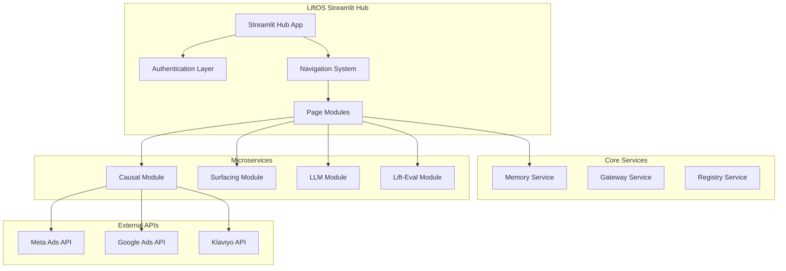

# LiftOS Streamlit Architecture Plan

## 🏗️ **STREAMLIT ARCHITECTURE OVERVIEW**

### **System Architecture**


## 📁 **FILE STRUCTURE**

### **Streamlit Application Structure**
```
liftos-streamlit/
├── app.py                          # Main Streamlit application
├── requirements.txt                # Python dependencies
├── config/
│   ├── __init__.py
│   ├── settings.py                 # Configuration management
│   └── secrets.py                  # API keys and secrets
├── auth/
│   ├── __init__.py
│   ├── authenticator.py            # Authentication logic
│   └── session_manager.py          # Session state management
├── pages/
│   ├── __init__.py
│   ├── 1_🧠_Causal_Analysis.py     # Causal analysis interface
│   ├── 2_🔍_Surfacing.py           # Surfacing interface
│   ├── 3_🤖_LLM_Assistant.py       # LLM interface
│   ├── 4_📊_Lift_Evaluation.py     # Lift evaluation interface
│   ├── 5_🧠_Memory_Search.py       # Memory search interface
│   └── 6_⚙️_Settings.py            # Configuration interface
├── components/
│   ├── __init__.py
│   ├── sidebar.py                  # Shared sidebar components
│   ├── charts.py                   # Visualization components
│   ├── data_display.py             # Data table components
│   └── api_connectors.py           # API integration helpers
├── utils/
│   ├── __init__.py
│   ├── api_client.py               # HTTP client for microservices
│   ├── data_processing.py          # Data transformation utilities
│   ├── visualization.py            # Chart creation utilities
│   └── error_handling.py           # Error handling utilities
├── styles/
│   ├── main.css                    # Custom CSS styling
│   └── theme.py                    # Streamlit theme configuration
├── data/
│   ├── sample_data/                # Sample datasets for demos
│   └── cache/                      # Temporary data cache
├── tests/
│   ├── test_auth.py
│   ├── test_api_client.py
│   └── test_components.py
├── docker/
│   ├── Dockerfile
│   └── docker-compose.yml
└── deployment/
    ├── streamlit_config.toml
    └── deploy.sh
```

## 🎯 **CORE APPLICATION DESIGN**

### **Main Application (`app.py`)**
```python
import streamlit as st
import sys
from pathlib import Path

# Add project root to path
sys.path.append(str(Path(__file__).parent))

from auth.authenticator import authenticate_user
from auth.session_manager import initialize_session
from config.settings import load_config
from components.sidebar import render_sidebar
from utils.api_client import APIClient

# Page configuration
st.set_page_config(
    page_title="LiftOS Hub",
    page_icon="🚀",
    layout="wide",
    initial_sidebar_state="expanded",
    menu_items={
        'Get Help': 'https://docs.liftos.ai',
        'Report a bug': 'https://github.com/liftos/issues',
        'About': "LiftOS - Marketing Intelligence Platform"
    }
)

def main():
    """Main application entry point"""
    
    # Load configuration
    config = load_config()
    
    # Initialize session state
    initialize_session()
    
    # Authentication check
    if not authenticate_user():
        st.stop()
    
    # Render sidebar navigation
    render_sidebar()
    
    # Main content area
    st.title("🚀 LiftOS Hub")
    st.markdown("### Marketing Intelligence & Causal Analysis Platform")
    
    # Quick stats dashboard
    render_dashboard_overview()
    
    # Recent activity
    render_recent_activity()

def render_dashboard_overview():
    """Render overview dashboard"""
    col1, col2, col3, col4 = st.columns(4)
    
    with col1:
        st.metric("Active Campaigns", "12", "2")
    with col2:
        st.metric("Attribution Models", "5", "1")
    with col3:
        st.metric("Data Sources", "3", "0")
    with col4:
        st.metric("Lift Experiments", "8", "3")

def render_recent_activity():
    """Render recent activity feed"""
    st.subheader("Recent Activity")
    
    # Fetch recent activity from memory service
    api_client = APIClient()
    recent_activity = api_client.get_recent_activity()
    
    for activity in recent_activity:
        with st.expander(f"{activity['type']} - {activity['timestamp']}"):
            st.json(activity['details'])

if __name__ == "__main__":
    main()
```

## 🔐 **AUTHENTICATION SYSTEM**

### **Authentication Module (`auth/authenticator.py`)**
```python
import streamlit as st
import requests
from typing import Optional, Dict
from config.settings import get_auth_config

class StreamlitAuthenticator:
    """Streamlit authentication handler"""
    
    def __init__(self):
        self.auth_config = get_auth_config()
        self.auth_service_url = self.auth_config['auth_service_url']
    
    def authenticate_user(self) -> bool:
        """Authenticate user and manage session"""
        
        # Check if already authenticated
        if st.session_state.get('authenticated', False):
            return True
        
        # Login form
        with st.sidebar:
            st.subheader("🔐 Login")
            
            with st.form("login_form"):
                username = st.text_input("Username")
                password = st.text_input("Password", type="password")
                submit = st.form_submit_button("Login")
                
                if submit:
                    if self._validate_credentials(username, password):
                        st.session_state.authenticated = True
                        st.session_state.username = username
                        st.session_state.user_id = self._get_user_id(username)
                        st.success("Login successful!")
                        st.rerun()
                    else:
                        st.error("Invalid credentials")
        
        return False
    
    def _validate_credentials(self, username: str, password: str) -> bool:
        """Validate user credentials with auth service"""
        try:
            response = requests.post(
                f"{self.auth_service_url}/api/v1/auth/login",
                json={"username": username, "password": password}
            )
            return response.status_code == 200
        except Exception as e:
            st.error(f"Authentication error: {e}")
            return False
    
    def _get_user_id(self, username: str) -> str:
        """Get user ID from username"""
        # Implementation to fetch user ID
        return f"user_{username}"

def authenticate_user() -> bool:
    """Main authentication function"""
    authenticator = StreamlitAuthenticator()
    return authenticator.authenticate_user()
```

## 📊 **PAGE MODULES**

### **Causal Analysis Page (`pages/1_🧠_Causal_Analysis.py`)**
```python
import streamlit as st
import pandas as pd
import plotly.express as px
from utils.api_client import APIClient
from components.charts import create_attribution_chart
from components.data_display import display_data_table

st.set_page_config(page_title="Causal Analysis", page_icon="🧠")

def main():
    st.title("🧠 Causal Analysis")
    st.markdown("### Marketing Attribution & Causal Inference")
    
    # Initialize API client
    api_client = APIClient()
    
    # Sidebar controls
    with st.sidebar:
        st.subheader("Data Sources")
        
        # Platform sync controls
        col1, col2 = st.columns(2)
        with col1:
            if st.button("🔄 Sync Meta", use_container_width=True):
                sync_platform("meta")
        with col2:
            if st.button("🔄 Sync Google", use_container_width=True):
                sync_platform("google")
        
        if st.button("🔄 Sync Klaviyo", use_container_width=True):
            sync_platform("klaviyo")
        
        st.divider()
        
        # Analysis parameters
        st.subheader("Analysis Parameters")
        date_range = st.date_input("Date Range", value=[])
        attribution_window = st.selectbox("Attribution Window", [1, 7, 14, 30])
        model_type = st.selectbox("Model Type", ["first_touch", "last_touch", "linear", "time_decay"])
    
    # Main content area
    tab1, tab2, tab3, tab4 = st.tabs(["📊 Data Overview", "🎯 Attribution", "🧪 Experiments", "💰 Budget Optimization"])
    
    with tab1:
        render_data_overview(api_client)
    
    with tab2:
        render_attribution_analysis(api_client, model_type, attribution_window)
    
    with tab3:
        render_experiments(api_client)
    
    with tab4:
        render_budget_optimization(api_client)

def sync_platform(platform: str):
    """Sync data from marketing platform"""
    api_client = APIClient()
    
    with st.spinner(f"Syncing {platform} data..."):
        try:
            result = api_client.sync_platform(platform)
            st.success(f"{platform} sync completed!")
            st.session_state[f'{platform}_data'] = result['data']
        except Exception as e:
            st.error(f"Sync failed: {e}")

def render_data_overview(api_client: APIClient):
    """Render data overview tab"""
    st.subheader("📊 Data Overview")
    
    # Display synced data
    platforms = ['meta', 'google', 'klaviyo']
    
    for platform in platforms:
        if f'{platform}_data' in st.session_state:
            with st.expander(f"{platform.title()} Data"):
                data = st.session_state[f'{platform}_data']
                df = pd.DataFrame(data)
                st.dataframe(df, use_container_width=True)
                
                # Quick stats
                col1, col2, col3 = st.columns(3)
                with col1:
                    st.metric("Records", len(df))
                with col2:
                    st.metric("Spend", f"${df.get('spend', [0]).sum():,.2f}")
                with col3:
                    st.metric("Conversions", df.get('conversions', [0]).sum())

def render_attribution_analysis(api_client: APIClient, model_type: str, window: int):
    """Render attribution analysis tab"""
    st.subheader("🎯 Attribution Analysis")
    
    if st.button("🚀 Run Attribution Analysis", type="primary"):
        with st.spinner("Running attribution analysis..."):
            try:
                # Prepare analysis request
                request_data = {
                    "model_type": model_type,
                    "attribution_window": window,
                    "data_sources": ["meta", "google", "klaviyo"]
                }
                
                # Call causal service
                result = api_client.run_attribution_analysis(request_data)
                
                # Display results
                st.success("Analysis completed!")
                
                # Attribution chart
                chart = create_attribution_chart(result['attribution_data'])
                st.plotly_chart(chart, use_container_width=True)
                
                # Attribution table
                attribution_df = pd.DataFrame(result['attribution_data'])
                st.dataframe(attribution_df, use_container_width=True)
                
            except Exception as e:
                st.error(f"Analysis failed: {e}")

if __name__ == "__main__":
    main()
```

## 🔌 **API INTEGRATION**

### **API Client (`utils/api_client.py`)**
```python
import requests
import streamlit as st
from typing import Dict, Any, Optional
from config.settings import get_service_urls

class APIClient:
    """Centralized API client for microservice communication"""
    
    def __init__(self):
        self.service_urls = get_service_urls()
        self.session = requests.Session()
        self._setup_authentication()
    
    def _setup_authentication(self):
        """Setup authentication headers"""
        if 'auth_token' in st.session_state:
            self.session.headers.update({
                'Authorization': f"Bearer {st.session_state.auth_token}"
            })
    
    def sync_platform(self, platform: str, date_range: Optional[Dict] = None) -> Dict[str, Any]:
        """Sync data from marketing platform"""
        url = f"{self.service_urls['causal']}/api/v1/platforms/sync"
        
        payload = {
            "platforms": [platform],
            "date_range": date_range or {"days": 30},
            "sync_type": "full"
        }
        
        response = self.session.post(url, json=payload)
        response.raise_for_status()
        return response.json()
    
    def run_attribution_analysis(self, request_data: Dict[str, Any]) -> Dict[str, Any]:
        """Run attribution analysis"""
        url = f"{self.service_urls['causal']}/api/v1/attribution/analyze"
        
        response = self.session.post(url, json=request_data)
        response.raise_for_status()
        return response.json()
    
    def create_model(self, model_config: Dict[str, Any]) -> Dict[str, Any]:
        """Create attribution model"""
        url = f"{self.service_urls['causal']}/api/v1/models/create"
        
        response = self.session.post(url, json=model_config)
        response.raise_for_status()
        return response.json()
    
    def search_memory(self, query: str, filters: Optional[Dict] = None) -> Dict[str, Any]:
        """Search memory service"""
        url = f"{self.service_urls['memory']}/api/v1/search"
        
        params = {"query": query}
        if filters:
            params.update(filters)
        
        response = self.session.get(url, params=params)
        response.raise_for_status()
        return response.json()
    
    def get_recent_activity(self, limit: int = 10) -> list:
        """Get recent activity from memory"""
        url = f"{self.service_urls['memory']}/api/v1/recent"
        
        response = self.session.get(url, params={"limit": limit})
        response.raise_for_status()
        return response.json().get('activities', [])
```

## 🎨 **VISUALIZATION COMPONENTS**

### **Chart Components (`components/charts.py`)**
```python
import plotly.express as px
import plotly.graph_objects as go
import pandas as pd
from typing import Dict, Any

def create_attribution_chart(attribution_data: Dict[str, Any]) -> go.Figure:
    """Create attribution analysis chart"""
    df = pd.DataFrame(attribution_data)
    
    fig = px.bar(
        df, 
        x='channel', 
        y='attribution_value',
        color='model_type',
        title="Attribution Analysis by Channel",
        labels={'attribution_value': 'Attribution Value ($)'}
    )
    
    fig.update_layout(
        height=500,
        showlegend=True,
        title_x=0.5
    )
    
    return fig

def create_lift_chart(lift_data: Dict[str, Any]) -> go.Figure:
    """Create lift measurement chart"""
    df = pd.DataFrame(lift_data)
    
    fig = go.Figure()
    
    # Add control group
    fig.add_trace(go.Scatter(
        x=df['date'],
        y=df['control_group'],
        mode='lines',
        name='Control Group',
        line=dict(color='blue')
    ))
    
    # Add treatment group
    fig.add_trace(go.Scatter(
        x=df['date'],
        y=df['treatment_group'],
        mode='lines',
        name='Treatment Group',
        line=dict(color='red')
    ))
    
    fig.update_layout(
        title="Lift Measurement: Treatment vs Control",
        xaxis_title="Date",
        yaxis_title="Conversion Rate",
        height=500
    )
    
    return fig

def create_budget_optimization_chart(optimization_data: Dict[str, Any]) -> go.Figure:
    """Create budget optimization chart"""
    df = pd.DataFrame(optimization_data)
    
    fig = px.pie(
        df,
        values='recommended_budget',
        names='channel',
        title="Recommended Budget Allocation"
    )
    
    fig.update_layout(height=500)
    
    return fig
```

## ⚙️ **CONFIGURATION MANAGEMENT**

### **Settings (`config/settings.py`)**
```python
import os
import streamlit as st
from typing import Dict, Any

def load_config() -> Dict[str, Any]:
    """Load application configuration"""
    return {
        'app_name': 'LiftOS Hub',
        'version': '1.0.0',
        'debug': os.getenv('DEBUG', 'false').lower() == 'true',
        'services': get_service_urls(),
        'auth': get_auth_config(),
        'features': get_feature_flags()
    }

def get_service_urls() -> Dict[str, str]:
    """Get microservice URLs"""
    return {
        'causal': os.getenv('CAUSAL_SERVICE_URL', 'http://localhost:8001'),
        'surfacing': os.getenv('SURFACING_SERVICE_URL', 'http://localhost:8002'),
        'llm': os.getenv('LLM_SERVICE_URL', 'http://localhost:8003'),
        'memory': os.getenv('MEMORY_SERVICE_URL', 'http://localhost:8004'),
        'auth': os.getenv('AUTH_SERVICE_URL', 'http://localhost:8005')
    }

def get_auth_config() -> Dict[str, Any]:
    """Get authentication configuration"""
    return {
        'auth_service_url': os.getenv('AUTH_SERVICE_URL', 'http://localhost:8005'),
        'session_timeout': int(os.getenv('SESSION_TIMEOUT', '3600')),
        'require_auth': os.getenv('REQUIRE_AUTH', 'true').lower() == 'true'
    }

def get_feature_flags() -> Dict[str, bool]:
    """Get feature flags"""
    return {
        'enable_causal': os.getenv('ENABLE_CAUSAL', 'true').lower() == 'true',
        'enable_surfacing': os.getenv('ENABLE_SURFACING', 'true').lower() == 'true',
        'enable_llm': os.getenv('ENABLE_LLM', 'true').lower() == 'true',
        'enable_experiments': os.getenv('ENABLE_EXPERIMENTS', 'true').lower() == 'true'
    }
```

## 🚀 **DEPLOYMENT CONFIGURATION**

### **Dockerfile**
```dockerfile
FROM python:3.11-slim

WORKDIR /app

# Install system dependencies
RUN apt-get update && apt-get install -y \
    gcc \
    && rm -rf /var/lib/apt/lists/*

# Copy requirements and install Python dependencies
COPY requirements.txt .
RUN pip install --no-cache-dir -r requirements.txt

# Copy application code
COPY . .

# Create non-root user
RUN useradd -m -u 1000 streamlit
RUN chown -R streamlit:streamlit /app
USER streamlit

# Expose port
EXPOSE 8501

# Health check
HEALTHCHECK CMD curl --fail http://localhost:8501/_stcore/health

# Run Streamlit
CMD ["streamlit", "run", "app.py", "--server.port=8501", "--server.address=0.0.0.0"]
```

### **Docker Compose (`docker-compose.yml`)**
```yaml
version: '3.8'

services:
  liftos-streamlit:
    build: .
    ports:
      - "8501:8501"
    environment:
      - CAUSAL_SERVICE_URL=http://causal:8001
      - SURFACING_SERVICE_URL=http://surfacing:8002
      - LLM_SERVICE_URL=http://llm:8003
      - MEMORY_SERVICE_URL=http://memory:8004
      - AUTH_SERVICE_URL=http://auth:8005
    depends_on:
      - causal
      - surfacing
      - llm
      - memory
      - auth
    networks:
      - liftos-network
    volumes:
      - ./data:/app/data
    restart: unless-stopped

networks:
  liftos-network:
    external: true
```

## 📋 **DEVELOPMENT WORKFLOW**

### **Development Setup**
```bash
# 1. Clone repository
git clone https://github.com/liftos/streamlit-hub
cd streamlit-hub

# 2. Create virtual environment
python -m venv venv
source venv/bin/activate  # On Windows: venv\Scripts\activate

# 3. Install dependencies
pip install -r requirements.txt

# 4. Set environment variables
cp .env.example .env
# Edit .env with your configuration

# 5. Run development server
streamlit run app.py
```

### **Testing Strategy**
```bash
# Unit tests
pytest tests/

# Integration tests
pytest tests/integration/

# UI tests (using Selenium)
pytest tests/ui/

# Performance tests
pytest tests/performance/
```

## 🎯 **IMPLEMENTATION TIMELINE**

### **Week 1: Core Infrastructure**
- [ ] Basic Streamlit app structure
- [ ] Authentication system
- [ ] API client implementation
- [ ] Basic navigation

### **Week 2: Causal Analysis Module**
- [ ] Platform sync interface
- [ ] Attribution analysis page
- [ ] Data visualization components
- [ ] Basic error handling

### **Week 3: Additional Modules**
- [ ] Surfacing module interface
- [ ] LLM assistant page
- [ ] Memory search functionality
- [ ] Settings and configuration

### **Week 4: Polish & Testing**
- [ ] UI/UX improvements
- [ ] Comprehensive testing
- [ ] Performance optimization
- [ ] Documentation

### **Week 5: Deployment**
- [ ] Docker containerization
- [ ] Production deployment
- [ ] Monitoring setup
- [ ] User acceptance testing

## 🎯 **SUCCESS METRICS**

### **Technical Metrics**
- **Page Load Time**: <2 seconds
- **API Response Time**: <500ms
- **Error Rate**: <1%
- **Uptime**: >99.9%

### **User Experience Metrics**
- **User Satisfaction**: >4.5/5
- **Task Completion Rate**: >90%
- **Time to First Value**: <5 minutes
- **Feature Adoption**: >80%

### **Business Metrics**
- **Development Time**: <5 weeks
- **Maintenance Cost**: <2 hours/week
- **User Onboarding**: <30 minutes
- **Feature Velocity**: New features in days, not weeks

This Streamlit architecture provides a **simple, powerful, and maintainable** solution that perfectly aligns with LiftOS's microservice architecture and data science user base.