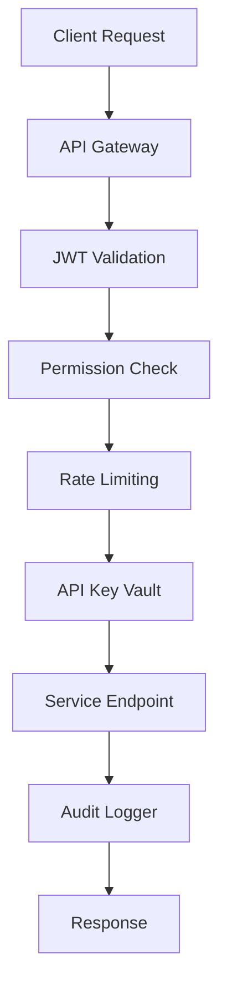
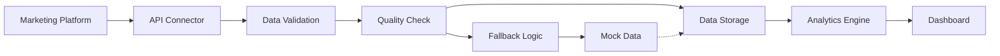

# LiftOS Secure API Documentation

## Overview

LiftOS provides enterprise-grade secure APIs for marketing intelligence and platform integration. This documentation covers authentication, authorization, data security, and live data mode configuration.

## Table of Contents

1. [Security Architecture](#security-architecture)
2. [Authentication & Authorization](#authentication--authorization)
3. [API Key Management](#api-key-management)
4. [Platform Connections API](#platform-connections-api)
5. [Live Data Mode](#live-data-mode)
6. [Security Compliance](#security-compliance)
7. [Rate Limiting & Monitoring](#rate-limiting--monitoring)
8. [Error Handling](#error-handling)

---

## Security Architecture

### Enterprise Security Standards

LiftOS implements bank-grade security following SOC 2 Type II compliance standards:

- **AES-256-GCM Encryption**: All sensitive data encrypted at rest and in transit
- **PBKDF2-HMAC-SHA256**: Key derivation with 100,000 iterations
- **JWT Authentication**: Stateless token-based authentication
- **Role-Based Access Control (RBAC)**: Granular permission management
- **Comprehensive Audit Logging**: Full security event tracking

### Security Components



---

## Authentication & Authorization

### JWT Token Structure

```json
{
  "user_id": "user_123",
  "org_id": "org_456",
  "roles": ["admin", "data_analyst"],
  "permissions": ["read:connections", "write:connections"],
  "iat": 1704067200,
  "exp": 1704153600,
  "type": "access_token"
}
```

### Authentication Headers

```http
Authorization: Bearer <jwt_token>
X-Organization-ID: org_456
X-Request-ID: req_789
```

### Permission Levels

| Role | Permissions | Description |
|------|-------------|-------------|
| `viewer` | `read:*` | Read-only access to all resources |
| `analyst` | `read:*, write:reports` | Data analysis and reporting |
| `manager` | `read:*, write:connections` | Platform connection management |
| `admin` | `*` | Full system access |

---

## API Key Management

### Enterprise API Key Vault

The API Key Vault provides secure storage for marketing platform credentials:

#### Encryption Specifications

- **Algorithm**: AES-256-GCM
- **Key Derivation**: PBKDF2-HMAC-SHA256 (100,000 iterations)
- **Salt**: 128-bit random salt per key
- **IV**: 96-bit random initialization vector

#### Supported Platforms

| Tier | Platforms | Auth Type |
|------|-----------|-----------|
| **Tier 1** | Meta Business, Google Ads, Klaviyo | OAuth2 / API Key |
| **Tier 2** | Shopify, HubSpot, Salesforce, Stripe | OAuth2 / API Key |
| **Tier 3** | TikTok, Snowflake, Databricks | OAuth2 / API Key |
| **Tier 4** | LinkedIn Ads, X Ads, Zoho CRM | OAuth2 / API Key |

#### API Key Storage Model

```python
class EncryptedAPIKey:
    id: UUID
    user_id: str
    org_id: str
    provider: str
    encrypted_key: str      # Base64 encoded encrypted credentials
    salt: str              # Base64 encoded salt
    iv: str                # Base64 encoded IV
    status: str            # active, rotated, revoked, expired
    usage_count: int
    last_used: datetime
    next_rotation: datetime
    created_at: datetime
    updated_at: datetime
```

### Key Management Operations

#### Store API Key

```http
POST /api/v1/vault/keys
Authorization: Bearer <jwt_token>
Content-Type: application/json

{
  "provider": "meta_business",
  "key_name": "production_key",
  "credentials": {
    "access_token": "EAABwzLixnjYBO...",
    "app_id": "123456789",
    "app_secret": "abc123def456",
    "ad_account_id": "act_987654321"
  },
  "metadata": {
    "environment": "production",
    "description": "Main Meta Business account"
  }
}
```

#### Retrieve API Key

```http
GET /api/v1/vault/keys/{provider}/{key_name}
Authorization: Bearer <jwt_token>
X-Organization-ID: org_456
```

#### Rotate API Key

```http
POST /api/v1/vault/keys/{provider}/{key_name}/rotate
Authorization: Bearer <jwt_token>

{
  "new_credentials": {
    "access_token": "EAABwzLixnjYBO_NEW...",
    "app_secret": "new_secret_123"
  }
}
```

---

## Platform Connections API

### Base URL

```
https://api.liftos.com/api/v1/platform-connections
```

### Endpoints Overview

| Method | Endpoint | Description |
|--------|----------|-------------|
| `GET` | `/platforms` | List supported platforms |
| `POST` | `/connections` | Create platform connection |
| `GET` | `/connections` | List user connections |
| `GET` | `/connections/{id}` | Get connection details |
| `PUT` | `/connections/{id}` | Update connection |
| `DELETE` | `/connections/{id}` | Delete connection |
| `POST` | `/connections/{id}/test` | Test connection |
| `POST` | `/connections/{id}/sync` | Manual sync |
| `GET` | `/dashboard` | Connection dashboard |
| `GET` | `/preferences` | Data preferences |
| `PUT` | `/preferences` | Update preferences |

### Create Platform Connection

#### OAuth2 Flow (Meta Business)

```http
POST /api/v1/platform-connections/oauth/initiate
Authorization: Bearer <jwt_token>
Content-Type: application/json

{
  "platform": "meta_business",
  "redirect_uri": "https://app.liftos.com/oauth/callback",
  "scopes": ["ads_read", "ads_management", "business_management"]
}
```

Response:
```json
{
  "authorization_url": "https://www.facebook.com/v18.0/dialog/oauth?client_id=...",
  "state": "secure_random_state_123",
  "expires_in": 600
}
```

#### Manual Credentials (Klaviyo)

```http
POST /api/v1/platform-connections/connections
Authorization: Bearer <jwt_token>
Content-Type: application/json

{
  "platform": "klaviyo",
  "connection_name": "Main Klaviyo Account",
  "credentials": {
    "api_key": "pk_live_abc123def456..."
  },
  "sync_frequency": "hourly",
  "auto_sync_enabled": true
}
```

### Connection Response Model

```json
{
  "id": "conn_123",
  "platform": "klaviyo",
  "connection_name": "Main Klaviyo Account",
  "status": "active",
  "last_sync": "2024-01-01T12:00:00Z",
  "next_sync": "2024-01-01T13:00:00Z",
  "sync_frequency": "hourly",
  "auto_sync_enabled": true,
  "data_sources": [
    {
      "type": "campaigns",
      "last_updated": "2024-01-01T12:00:00Z",
      "record_count": 1250
    },
    {
      "type": "metrics",
      "last_updated": "2024-01-01T12:00:00Z",
      "record_count": 5000
    }
  ],
  "health_status": {
    "status": "healthy",
    "last_check": "2024-01-01T12:00:00Z",
    "response_time_ms": 245
  },
  "created_at": "2024-01-01T10:00:00Z",
  "updated_at": "2024-01-01T12:00:00Z"
}
```

### Test Connection

```http
POST /api/v1/platform-connections/connections/{connection_id}/test
Authorization: Bearer <jwt_token>
```

Response:
```json
{
  "status": "success",
  "response_time_ms": 234,
  "data_sources_available": [
    "campaigns",
    "metrics",
    "audiences"
  ],
  "api_rate_limit": {
    "remaining": 4950,
    "reset_time": "2024-01-01T13:00:00Z"
  },
  "test_timestamp": "2024-01-01T12:30:00Z"
}
```

---

## Live Data Mode

### Configuration Overview

Live Data Mode enables real-time data ingestion from connected marketing platforms, replacing mock data with actual API responses.

### Environment Configuration

```bash
# Demo Mode (Default)
DEMO_MODE=true
REQUIRE_AUTH=false
PREFER_LIVE_DATA=false

# Live Data Mode
DEMO_MODE=false
REQUIRE_AUTH=true
PREFER_LIVE_DATA=true
FALLBACK_TO_MOCK=true
AUTO_SYNC_ENABLED=true
```

### Data Preferences API

#### Get Preferences

```http
GET /api/v1/platform-connections/preferences
Authorization: Bearer <jwt_token>
```

Response:
```json
{
  "prefer_live_data": true,
  "fallback_to_mock": true,
  "auto_sync_enabled": true,
  "data_retention_days": 90,
  "sync_frequency_default": "hourly",
  "quality_threshold": 0.95
}
```

#### Update Preferences

```http
PUT /api/v1/platform-connections/preferences
Authorization: Bearer <jwt_token>
Content-Type: application/json

{
  "prefer_live_data": true,
  "fallback_to_mock": false,
  "auto_sync_enabled": true,
  "data_retention_days": 180
}
```

### Data Flow Architecture



### Sync Management

#### Manual Sync

```http
POST /api/v1/platform-connections/connections/{connection_id}/sync
Authorization: Bearer <jwt_token>
Content-Type: application/json

{
  "sync_type": "manual",
  "data_sources": ["campaigns", "metrics"],
  "date_range": {
    "start_date": "2024-01-01",
    "end_date": "2024-01-31"
  }
}
```

#### Bulk Sync

```http
POST /api/v1/platform-connections/bulk-sync
Authorization: Bearer <jwt_token>
Content-Type: application/json

{
  "connection_ids": ["conn_123", "conn_456"],
  "sync_type": "scheduled",
  "priority": "high"
}
```

### Data Quality Monitoring

#### Quality Metrics

```http
GET /api/v1/data-quality/metrics
Authorization: Bearer <jwt_token>
```

Response:
```json
{
  "overall_quality_score": 0.96,
  "data_sources": [
    {
      "platform": "meta_business",
      "quality_score": 0.98,
      "completeness": 0.99,
      "accuracy": 0.97,
      "timeliness": 0.98,
      "last_assessment": "2024-01-01T12:00:00Z"
    }
  ],
  "quality_trends": {
    "7_day_average": 0.95,
    "30_day_average": 0.94
  }
}
```

---

## Security Compliance

### SOC 2 Type II Compliance

LiftOS maintains SOC 2 Type II compliance through:

#### Security Controls

- **Access Control**: Multi-factor authentication, role-based permissions
- **Encryption**: AES-256 encryption at rest and in transit
- **Monitoring**: Real-time security event monitoring
- **Incident Response**: Automated threat detection and response
- **Audit Logging**: Comprehensive audit trail for all activities

#### Audit Events

```python
class SecurityEventType(Enum):
    # Authentication
    LOGIN_SUCCESS = "login_success"
    LOGIN_FAILURE = "login_failure"
    
    # API Key Management
    API_KEY_CREATED = "api_key_created"
    API_KEY_ACCESSED = "api_key_accessed"
    API_KEY_ROTATED = "api_key_rotated"
    
    # Security Violations
    RATE_LIMIT_EXCEEDED = "rate_limit_exceeded"
    SUSPICIOUS_ACTIVITY = "suspicious_activity"
    
    # Data Access
    SENSITIVE_DATA_ACCESS = "sensitive_data_access"
    DATA_EXPORT = "data_export"
```

### Data Privacy

#### GDPR Compliance

- **Data Minimization**: Only collect necessary data
- **Purpose Limitation**: Data used only for specified purposes
- **Right to Erasure**: Complete data deletion capabilities
- **Data Portability**: Export user data in standard formats

#### Data Retention

```json
{
  "retention_policies": {
    "marketing_data": "2_years",
    "audit_logs": "7_years",
    "api_keys": "until_revoked",
    "user_sessions": "24_hours"
  }
}
```

---

## Rate Limiting & Monitoring

### Rate Limits

| Endpoint Category | Rate Limit | Window |
|------------------|------------|---------|
| Authentication | 10 requests | 1 minute |
| Platform Connections | 100 requests | 1 hour |
| Data Sync | 50 requests | 1 hour |
| Analytics | 1000 requests | 1 hour |

### Rate Limit Headers

```http
X-RateLimit-Limit: 100
X-RateLimit-Remaining: 95
X-RateLimit-Reset: 1704067200
X-RateLimit-Window: 3600
```

### Monitoring Endpoints

#### System Health

```http
GET /api/v1/health
```

Response:
```json
{
  "status": "healthy",
  "timestamp": "2024-01-01T12:00:00Z",
  "services": {
    "auth": "healthy",
    "data_ingestion": "healthy",
    "vault": "healthy",
    "database": "healthy"
  },
  "metrics": {
    "response_time_ms": 45,
    "active_connections": 1250,
    "error_rate": 0.001
  }
}
```

---

## Error Handling

### Standard Error Response

```json
{
  "error": {
    "code": "INVALID_CREDENTIALS",
    "message": "The provided API credentials are invalid",
    "details": {
      "provider": "meta_business",
      "field": "access_token"
    },
    "request_id": "req_123",
    "timestamp": "2024-01-01T12:00:00Z"
  }
}
```

### Error Codes

| Code | HTTP Status | Description |
|------|-------------|-------------|
| `AUTHENTICATION_REQUIRED` | 401 | Valid JWT token required |
| `INSUFFICIENT_PERMISSIONS` | 403 | User lacks required permissions |
| `INVALID_CREDENTIALS` | 400 | Platform credentials invalid |
| `RATE_LIMIT_EXCEEDED` | 429 | Rate limit exceeded |
| `PLATFORM_UNAVAILABLE` | 503 | External platform unavailable |
| `DATA_QUALITY_FAILED` | 422 | Data quality checks failed |

### Security Error Handling

Security-related errors are logged but return generic messages to prevent information disclosure:

```json
{
  "error": {
    "code": "ACCESS_DENIED",
    "message": "Access denied",
    "request_id": "req_123"
  }
}
```

---

## SDK Examples

### Python SDK

```python
from liftos_sdk import LiftOSClient

# Initialize client
client = LiftOSClient(
    api_key="your_api_key",
    base_url="https://api.liftos.com"
)

# Create platform connection
connection = client.platform_connections.create(
    platform="klaviyo",
    credentials={
        "api_key": "pk_live_abc123..."
    },
    auto_sync=True
)

# Test connection
test_result = client.platform_connections.test(connection.id)
print(f"Connection status: {test_result.status}")

# Sync data
sync_result = client.platform_connections.sync(
    connection.id,
    data_sources=["campaigns", "metrics"]
)
```

### JavaScript SDK

```javascript
import { LiftOSClient } from '@liftos/sdk';

const client = new LiftOSClient({
  apiKey: 'your_api_key',
  baseURL: 'https://api.liftos.com'
});

// Create connection
const connection = await client.platformConnections.create({
  platform: 'meta_business',
  credentials: {
    access_token: 'EAABwzLixnjYBO...',
    app_id: '123456789'
  }
});

// Monitor sync status
const status = await client.platformConnections.getSyncStatus(connection.id);
console.log('Sync status:', status);
```

---

## Support & Resources

### Documentation Links

- [API Reference](https://docs.liftos.com/api)
- [Security Guide](https://docs.liftos.com/security)
- [Platform Integration Guide](https://docs.liftos.com/integrations)
- [Troubleshooting](https://docs.liftos.com/troubleshooting)

### Support Channels

- **Technical Support**: support@liftos.com
- **Security Issues**: security@liftos.com
- **Documentation**: docs@liftos.com

### Status Page

Monitor API status and incidents: [status.liftos.com](https://status.liftos.com)