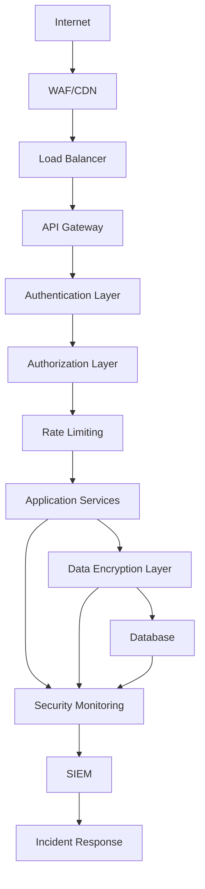

# LiftOS Security Guide

## Overview

LiftOS implements enterprise-grade security following SOC 2 Type II compliance standards. This guide covers security architecture, best practices, and compliance requirements.

## Table of Contents

1. [Security Architecture](#security-architecture)
2. [Authentication & Authorization](#authentication--authorization)
3. [Data Encryption](#data-encryption)
4. [API Security](#api-security)
5. [Audit & Compliance](#audit--compliance)
6. [Incident Response](#incident-response)
7. [Security Best Practices](#security-best-practices)

---

## Security Architecture

### Defense in Depth

LiftOS implements multiple layers of security controls:



### Security Components

| Component | Technology | Purpose |
|-----------|------------|---------|
| **WAF** | CloudFlare/AWS WAF | Web application firewall |
| **TLS/SSL** | TLS 1.3 | Transport encryption |
| **JWT** | RS256/HS256 | Stateless authentication |
| **RBAC** | Custom implementation | Role-based access control |
| **Encryption** | AES-256-GCM | Data encryption at rest |
| **Hashing** | PBKDF2-HMAC-SHA256 | Password/key derivation |
| **Audit Logging** | PostgreSQL + ELK | Comprehensive audit trail |

---

## Authentication & Authorization

### Multi-Factor Authentication (MFA)

LiftOS supports multiple MFA methods:

#### TOTP (Time-based One-Time Password)

```python
# Enable TOTP for user
from shared.auth.mfa import TOTPManager

totp_manager = TOTPManager()
secret = totp_manager.generate_secret()
qr_code = totp_manager.generate_qr_code(
    secret=secret,
    user_email="user@example.com",
    issuer="LiftOS"
)

# Verify TOTP token
is_valid = totp_manager.verify_token(
    secret=secret,
    token="123456"
)
```

#### SMS/Email OTP

```python
# Send OTP via SMS
from shared.auth.otp import OTPManager

otp_manager = OTPManager()
otp_code = otp_manager.send_sms_otp(
    phone_number="+1234567890",
    user_id="user_123"
)

# Verify OTP
is_valid = otp_manager.verify_otp(
    user_id="user_123",
    otp_code="123456",
    method="sms"
)
```

### Role-Based Access Control (RBAC)

#### Permission Model

```python
class Permission(Enum):
    # Platform connections
    READ_CONNECTIONS = "read:connections"
    WRITE_CONNECTIONS = "write:connections"
    DELETE_CONNECTIONS = "delete:connections"
    
    # Data access
    READ_DATA = "read:data"
    EXPORT_DATA = "export:data"
    
    # System administration
    MANAGE_USERS = "manage:users"
    MANAGE_SYSTEM = "manage:system"
    VIEW_AUDIT_LOGS = "view:audit_logs"

class Role(Enum):
    VIEWER = "viewer"
    ANALYST = "analyst"
    MANAGER = "manager"
    ADMIN = "admin"
    SUPER_ADMIN = "super_admin"
```

#### Role Permissions Matrix

| Role | Permissions | Description |
|------|-------------|-------------|
| **Viewer** | `read:*` | Read-only access to all resources |
| **Analyst** | `read:*, export:data` | Data analysis and export |
| **Manager** | `read:*, write:connections, export:data` | Platform management |
| **Admin** | `read:*, write:*, delete:*, manage:users` | Full organizational access |
| **Super Admin** | `*` | System-wide administration |

#### Permission Enforcement

```python
from shared.auth.decorators import require_permissions

@require_permissions(["read:connections"])
async def get_connections(user_context: UserContext):
    """Get user's platform connections"""
    pass

@require_permissions(["write:connections", "manage:users"])
async def create_connection(user_context: UserContext):
    """Create new platform connection"""
    pass
```

### Session Management

#### JWT Token Configuration

```python
JWT_CONFIG = {
    "algorithm": "RS256",  # RSA with SHA-256
    "access_token_expire_minutes": 60,
    "refresh_token_expire_days": 30,
    "issuer": "liftos.com",
    "audience": "liftos-api"
}
```

#### Token Validation

```python
from shared.auth.jwt_auth import JWTAuth

jwt_auth = JWTAuth()

# Validate token
try:
    payload = jwt_auth.validate_token(token)
    user_id = payload["user_id"]
    org_id = payload["org_id"]
    permissions = payload["permissions"]
except InvalidTokenError:
    raise HTTPException(status_code=401, detail="Invalid token")
```

#### Session Security

- **Secure Cookies**: HttpOnly, Secure, SameSite=Strict
- **Token Rotation**: Automatic refresh token rotation
- **Session Timeout**: Configurable inactivity timeout
- **Concurrent Sessions**: Limit concurrent sessions per user

---

## Data Encryption

### Encryption at Rest

#### Database Encryption

```python
from shared.security.encryption import FieldEncryption

class EncryptedAPIKey(Base):
    __tablename__ = "encrypted_api_keys"
    
    # Encrypted fields
    encrypted_key = Column(Text, nullable=False)
    salt = Column(String(255), nullable=False)
    iv = Column(String(255), nullable=False)
    
    @property
    def decrypted_key(self) -> str:
        """Decrypt the API key"""
        return FieldEncryption.decrypt(
            encrypted_data=self.encrypted_key,
            salt=self.salt,
            iv=self.iv
        )
    
    @decrypted_key.setter
    def decrypted_key(self, value: str):
        """Encrypt and store the API key"""
        encrypted_data, salt, iv = FieldEncryption.encrypt(value)
        self.encrypted_key = encrypted_data
        self.salt = salt
        self.iv = iv
```

#### File System Encryption

```bash
# Enable filesystem encryption (Linux)
sudo cryptsetup luksFormat /dev/sdb
sudo cryptsetup luksOpen /dev/sdb liftos_encrypted
sudo mkfs.ext4 /dev/mapper/liftos_encrypted
sudo mount /dev/mapper/liftos_encrypted /var/lib/liftos

# Configure automatic mounting
echo "liftos_encrypted /var/lib/liftos ext4 defaults 0 2" >> /etc/fstab
```

### Encryption in Transit

#### TLS Configuration

```nginx
# Nginx TLS configuration
server {
    listen 443 ssl http2;
    server_name api.liftos.com;
    
    # TLS 1.3 only
    ssl_protocols TLSv1.3;
    ssl_ciphers ECDHE-ECDSA-AES256-GCM-SHA384:ECDHE-RSA-AES256-GCM-SHA384;
    ssl_prefer_server_ciphers off;
    
    # HSTS
    add_header Strict-Transport-Security "max-age=31536000; includeSubDomains; preload" always;
    
    # Certificate configuration
    ssl_certificate /etc/ssl/certs/liftos.crt;
    ssl_certificate_key /etc/ssl/private/liftos.key;
    
    # OCSP stapling
    ssl_stapling on;
    ssl_stapling_verify on;
}
```

#### API Client TLS

```python
import httpx

# Secure HTTP client configuration
client = httpx.AsyncClient(
    verify=True,  # Verify SSL certificates
    timeout=30.0,
    limits=httpx.Limits(max_connections=100),
    headers={
        "User-Agent": "LiftOS/1.4.0",
        "Accept": "application/json"
    }
)

# Certificate pinning for critical APIs
PINNED_CERTIFICATES = {
    "api.facebook.com": "sha256/ABC123...",
    "googleads.googleapis.com": "sha256/DEF456..."
}
```

### Key Management

#### Master Key Rotation

```python
from shared.security.key_rotation import KeyRotationManager

class KeyRotationManager:
    def __init__(self):
        self.vault = APIKeyVault()
        self.audit_logger = SecurityAuditLogger()
    
    async def rotate_master_key(self, new_master_key: str):
        """Rotate the master encryption key"""
        # 1. Generate new master key
        # 2. Re-encrypt all data with new key
        # 3. Update key references
        # 4. Audit the rotation
        
        async with get_async_session() as session:
            # Get all encrypted keys
            encrypted_keys = await session.execute(
                select(EncryptedAPIKey).where(
                    EncryptedAPIKey.status == "active"
                )
            )
            
            for key_record in encrypted_keys.scalars():
                # Decrypt with old key
                decrypted_data = self.vault._decrypt_data(
                    key_record.encrypted_key,
                    key_record.salt,
                    key_record.iv
                )
                
                # Re-encrypt with new key
                new_encrypted, new_salt, new_iv = self.vault._encrypt_data(
                    decrypted_data
                )
                
                # Update record
                key_record.encrypted_key = new_encrypted
                key_record.salt = new_salt
                key_record.iv = new_iv
                key_record.rotated_at = datetime.utcnow()
            
            await session.commit()
            
            # Audit the rotation
            await self.audit_logger.log_security_event(
                session=session,
                event_type=SecurityEventType.KEY_ROTATION,
                details={"rotated_keys": len(encrypted_keys.scalars())}
            )
```

---

## API Security

### Input Validation

#### Request Validation

```python
from pydantic import BaseModel, validator
from typing import List, Optional

class CreateConnectionRequest(BaseModel):
    platform: str
    credentials: Dict[str, str]
    connection_name: Optional[str] = None
    
    @validator('platform')
    def validate_platform(cls, v):
        allowed_platforms = [
            'meta_business', 'google_ads', 'klaviyo', 
            'shopify', 'hubspot', 'salesforce'
        ]
        if v not in allowed_platforms:
            raise ValueError(f'Platform {v} not supported')
        return v
    
    @validator('credentials')
    def validate_credentials(cls, v, values):
        platform = values.get('platform')
        
        # Platform-specific validation
        if platform == 'klaviyo':
            if 'api_key' not in v:
                raise ValueError('API key required for Klaviyo')
            if not v['api_key'].startswith(('pk_live_', 'pk_test_')):
                raise ValueError('Invalid Klaviyo API key format')
        
        return v
```

#### SQL Injection Prevention

```python
from sqlalchemy import text

# ✅ DO: Use parameterized queries
async def get_connections_by_platform(platform: str):
    query = text("""
        SELECT * FROM platform_connections 
        WHERE platform = :platform AND status = 'active'
    """)
    result = await session.execute(query, {"platform": platform})
    return result.fetchall()

# ❌ DON'T: String concatenation
async def get_connections_unsafe(platform: str):
    query = f"SELECT * FROM platform_connections WHERE platform = '{platform}'"
    # This is vulnerable to SQL injection!
```

### Rate Limiting

#### Adaptive Rate Limiting

```python
from shared.security.rate_limiting import AdaptiveRateLimiter

class AdaptiveRateLimiter:
    def __init__(self):
        self.redis_client = redis.Redis()
        self.base_limits = {
            "auth": 10,      # per minute
            "api": 1000,     # per hour
            "sync": 50       # per hour
        }
    
    async def check_rate_limit(
        self, 
        user_id: str, 
        endpoint_category: str,
        request_ip: str
    ) -> bool:
        """Check if request is within rate limits"""
        
        # Check user-based limits
        user_key = f"rate_limit:user:{user_id}:{endpoint_category}"
        user_requests = await self.redis_client.get(user_key) or 0
        
        # Check IP-based limits (for DDoS protection)
        ip_key = f"rate_limit:ip:{request_ip}"
        ip_requests = await self.redis_client.get(ip_key) or 0
        
        # Adaptive limits based on user behavior
        user_limit = self._calculate_adaptive_limit(user_id, endpoint_category)
        ip_limit = 10000  # Global IP limit per hour
        
        if int(user_requests) >= user_limit:
            await self._log_rate_limit_exceeded(user_id, "user_limit")
            return False
        
        if int(ip_requests) >= ip_limit:
            await self._log_rate_limit_exceeded(request_ip, "ip_limit")
            return False
        
        # Increment counters
        await self.redis_client.incr(user_key)
        await self.redis_client.expire(user_key, 3600)  # 1 hour
        await self.redis_client.incr(ip_key)
        await self.redis_client.expire(ip_key, 3600)
        
        return True
```

### CORS Configuration

```python
from fastapi.middleware.cors import CORSMiddleware

app.add_middleware(
    CORSMiddleware,
    allow_origins=[
        "https://app.liftos.com",
        "https://dashboard.liftos.com"
    ],
    allow_credentials=True,
    allow_methods=["GET", "POST", "PUT", "DELETE"],
    allow_headers=[
        "Authorization",
        "Content-Type",
        "X-Organization-ID",
        "X-Request-ID"
    ],
    expose_headers=[
        "X-RateLimit-Remaining",
        "X-RateLimit-Reset"
    ]
)
```

---

## Audit & Compliance

### SOC 2 Type II Compliance

#### Security Controls

| Control | Implementation | Evidence |
|---------|----------------|----------|
| **CC6.1** | Logical access controls | RBAC implementation, MFA |
| **CC6.2** | Authentication mechanisms | JWT, password policies |
| **CC6.3** | Authorization procedures | Permission matrix, audit logs |
| **CC6.7** | Data transmission controls | TLS 1.3, certificate pinning |
| **CC6.8** | System monitoring | Real-time monitoring, alerting |

#### Audit Logging

```python
from shared.security.audit_logger import SecurityAuditLogger

class SecurityAuditLogger:
    def __init__(self):
        self.session_factory = get_async_session
    
    async def log_security_event(
        self,
        event_type: SecurityEventType,
        user_id: Optional[str] = None,
        org_id: Optional[str] = None,
        ip_address: Optional[str] = None,
        user_agent: Optional[str] = None,
        details: Optional[Dict[str, Any]] = None,
        risk_level: str = "low"
    ):
        """Log security event for audit trail"""
        
        async with self.session_factory() as session:
            audit_log = SecurityAuditLog(
                event_type=event_type.value,
                user_id=user_id,
                org_id=org_id,
                ip_address=ip_address,
                user_agent=user_agent,
                event_details=details or {},
                risk_level=risk_level,
                timestamp=datetime.utcnow()
            )
            
            session.add(audit_log)
            await session.commit()
            
            # Real-time alerting for high-risk events
            if risk_level in ["high", "critical"]:
                await self._send_security_alert(audit_log)
```

#### Audit Event Types

```python
class SecurityEventType(Enum):
    # Authentication events
    LOGIN_SUCCESS = "login_success"
    LOGIN_FAILURE = "login_failure"
    MFA_ENABLED = "mfa_enabled"
    MFA_DISABLED = "mfa_disabled"
    PASSWORD_CHANGED = "password_changed"
    
    # Authorization events
    PERMISSION_GRANTED = "permission_granted"
    PERMISSION_DENIED = "permission_denied"
    ROLE_ASSIGNED = "role_assigned"
    ROLE_REVOKED = "role_revoked"
    
    # API Key events
    API_KEY_CREATED = "api_key_created"
    API_KEY_ACCESSED = "api_key_accessed"
    API_KEY_ROTATED = "api_key_rotated"
    API_KEY_REVOKED = "api_key_revoked"
    
    # Security violations
    RATE_LIMIT_EXCEEDED = "rate_limit_exceeded"
    SUSPICIOUS_ACTIVITY = "suspicious_activity"
    BRUTE_FORCE_ATTEMPT = "brute_force_attempt"
    IP_BLOCKED = "ip_blocked"
    
    # Data access events
    SENSITIVE_DATA_ACCESS = "sensitive_data_access"
    DATA_EXPORT = "data_export"
    BULK_DATA_ACCESS = "bulk_data_access"
    
    # System events
    CONFIGURATION_CHANGE = "configuration_change"
    SYSTEM_BACKUP = "system_backup"
    SYSTEM_RESTORE = "system_restore"
```

### GDPR Compliance

#### Data Subject Rights

```python
from shared.privacy.gdpr import GDPRManager

class GDPRManager:
    def __init__(self):
        self.session_factory = get_async_session
        self.encryption = FieldEncryption()
    
    async def export_user_data(self, user_id: str) -> Dict[str, Any]:
        """Export all user data (Right to Data Portability)"""
        
        async with self.session_factory() as session:
            # Collect all user data
            user_data = {
                "personal_info": await self._get_user_profile(session, user_id),
                "platform_connections": await self._get_user_connections(session, user_id),
                "audit_logs": await self._get_user_audit_logs(session, user_id),
                "preferences": await self._get_user_preferences(session, user_id)
            }
            
            # Log the export request
            await self._log_data_export(session, user_id)
            
            return user_data
    
    async def delete_user_data(self, user_id: str) -> bool:
        """Delete all user data (Right to Erasure)"""
        
        async with self.session_factory() as session:
            try:
                # Delete in correct order to maintain referential integrity
                await self._delete_user_connections(session, user_id)
                await self._delete_user_preferences(session, user_id)
                await self._anonymize_audit_logs(session, user_id)
                await self._delete_user_profile(session, user_id)
                
                await session.commit()
                
                # Log the deletion
                await self._log_data_deletion(session, user_id)
                
                return True
            except Exception as e:
                await session.rollback()
                logger.error(f"Failed to delete user data: {e}")
                return False
```

#### Data Processing Lawfulness

```python
class DataProcessingBasis(Enum):
    CONSENT = "consent"
    CONTRACT = "contract"
    LEGAL_OBLIGATION = "legal_obligation"
    VITAL_INTERESTS = "vital_interests"
    PUBLIC_TASK = "public_task"
    LEGITIMATE_INTERESTS = "legitimate_interests"

class DataProcessor:
    def __init__(self):
        self.processing_purposes = {
            "marketing_analytics": DataProcessingBasis.CONSENT,
            "platform_integration": DataProcessingBasis.CONTRACT,
            "security_monitoring": DataProcessingBasis.LEGITIMATE_INTERESTS,
            "audit_logging": DataProcessingBasis.LEGAL_OBLIGATION
        }
    
    async def process_data(
        self, 
        data: Dict[str, Any], 
        purpose: str,
        user_consent: Optional[bool] = None
    ):
        """Process data with GDPR compliance checks"""
        
        basis = self.processing_purposes.get(purpose)
        
        if basis == DataProcessingBasis.CONSENT and not user_consent:
            raise ValueError("User consent required for this processing purpose")
        
        # Process data according to purpose limitation principle
        processed_data = self._limit_data_to_purpose(data, purpose)
        
        # Log processing activity
        await self._log_processing_activity(purpose, basis, len(processed_data))
        
        return processed_data
```

---

## Incident Response

### Security Incident Classification

| Severity | Description | Response Time | Examples |
|----------|-------------|---------------|----------|
| **Critical** | Immediate threat to system security | 15 minutes | Data breach, system compromise |
| **High** | Significant security impact | 1 hour | Failed authentication spike, API abuse |
| **Medium** | Moderate security concern | 4 hours | Suspicious user activity, rate limiting |
| **Low** | Minor security event | 24 hours | Failed login attempts, configuration changes |

### Automated Incident Detection

```python
from shared.security.incident_detection import IncidentDetector

class IncidentDetector:
    def __init__(self):
        self.alert_thresholds = {
            "failed_logins": 10,      # per 5 minutes
            "rate_limit_hits": 100,   # per hour
            "api_errors": 50,         # per 10 minutes
            "suspicious_ips": 5       # unique IPs per user per hour
        }
    
    async def detect_brute_force_attack(self, user_id: str) -> bool:
        """Detect potential brute force attack"""
        
        # Check failed login attempts in last 5 minutes
        failed_attempts = await self._count_failed_logins(
            user_id=user_id,
            time_window_minutes=5
        )
        
        if failed_attempts >= self.alert_thresholds["failed_logins"]:
            await self._create_security_incident(
                incident_type="brute_force_attack",
                severity="high",
                affected_user=user_id,
                details={
                    "failed_attempts": failed_attempts,
                    "time_window": "5_minutes"
                }
            )
            
            # Automatically lock account
            await self._lock_user_account(user_id, reason="brute_force_protection")
            
            return True
        
        return False
    
    async def detect_api_abuse(self, user_id: str, endpoint: str) -> bool:
        """Detect API abuse patterns"""
        
        # Check rate limit violations
        rate_limit_hits = await self._count_rate_limit_hits(
            user_id=user_id,
            time_window_hours=1
        )
        
        if rate_limit_hits >= self.alert_thresholds["rate_limit_hits"]:
            await self._create_security_incident(
                incident_type="api_abuse",
                severity="medium",
                affected_user=user_id,
                details={
                    "rate_limit_hits": rate_limit_hits,
                    "endpoint": endpoint
                }
            )
            
            return True
        
        return False
```

### Incident Response Workflow

```python
from shared.security.incident_response import IncidentResponseManager

class IncidentResponseManager:
    def __init__(self):
        self.notification_service = NotificationService()
        self.audit_logger = SecurityAuditLogger()
    
    async def handle_security_incident(self, incident: SecurityIncident):
        """Handle security incident according to severity"""
        
        # 1. Immediate containment
        await self._contain_incident(incident)
        
        # 2. Notify security team
        await self._notify_security_team(incident)
        
        # 3. Collect evidence
        evidence = await self._collect_evidence(incident)
        
        # 4. Analyze and investigate
        analysis = await self._analyze_incident(incident, evidence)
        
        # 5. Remediate
        await self._remediate_incident(incident, analysis)
        
        # 6. Document and learn
        await self._document_incident(incident, analysis)
    
    async def _contain_incident(self, incident: SecurityIncident):
        """Immediate containment actions"""
        
        if incident.severity == "critical":
            # Critical incidents require immediate action
            if incident.type == "data_breach":
                await self._isolate_affected_systems()
                await self._revoke_all_api_keys()
            elif incident.type == "system_compromise":
                await self._enable_emergency_mode()
                await self._block_suspicious_ips()
        
        elif incident.severity == "high":
            # High severity incidents
            if incident.type == "brute_force_attack":
                await self._lock_affected_accounts()
                await self._increase_rate_limits()
```

---

## Security Best Practices

### Development Security

#### Secure Coding Guidelines

```python
# ✅ DO: Input validation
from pydantic import BaseModel, validator

class UserInput(BaseModel):
    email: str
    password: str
    
    @validator('email')
    def validate_email(cls, v):
        if not re.match(r'^[^@]+@[^@]+\.[^@]+$', v):
            raise ValueError('Invalid email format')
        return v.lower()
    
    @validator('password')
    def validate_password(cls, v):
        if len(v) < 12:
            raise ValueError('Password must be at least 12 characters')
        if not re.search(r'[A-Z]', v):
            raise ValueError('Password must contain uppercase letter')
        if not re.search(r'[a-z]', v):
            raise ValueError('Password must contain lowercase letter')
        if not re.search(r'\d', v):
            raise ValueError('Password must contain digit')
        if not re.search(r'[!@#$%^&*(),.?":{}|<>]', v):
            raise ValueError('Password must contain special character')
        return v

# ✅ DO: Secure password hashing
from passlib.context import CryptContext

pwd_context = CryptContext(
    schemes=["argon2"],
    deprecated="auto",
    argon2__memory_cost=65536,  # 64 MB
    argon2__time_cost=3,        # 3 iterations
    argon2__parallelism=1       # 1 thread
)

def hash_password(password: str) -> str:
    return pwd_context.hash(password)

def verify_password(password: str, hashed: str) -> bool:
    return pwd_context.verify(password, hashed)

# ✅ DO: Secure random generation
import secrets

def generate_api_key() -> str:
    return secrets.token_urlsafe(32)

def generate_session_id() -> str:
    return secrets.token_hex(16)

# ❌ DON'T: Use weak random generators
import random
api_key = str(random.randint(1000000, 9999999))  # Predictable!
```

#### Dependency Security

```yaml
# .github/workflows/security.yml
name: Security Scan

on: [push, pull_request]

jobs:
  security:
    runs-on: ubuntu-latest
    steps:
      - uses: actions/checkout@v3
      
      - name: Run Bandit Security Scan
        run: |
          pip install bandit
          bandit -r . -f json -o bandit-report.json
      
      - name: Run Safety Check
        run: |
          pip install safety
          safety check --json --output safety-report.json
      
      - name: Run Semgrep
        run: |
          pip install semgrep
          semgrep --config=auto --json --output=semgrep-report.json
```

### Infrastructure Security

#### Container Security

```dockerfile
# Dockerfile security best practices
FROM python:3.11-slim

# Create non-root user
RUN groupadd -r liftos && useradd -r -g liftos liftos

# Install security updates
RUN apt-get update && apt-get upgrade -y && \
    apt-get install -y --no-install-recommends \
    ca-certificates && \
    rm -rf /var/lib/apt/lists/*

# Set working directory
WORKDIR /app

# Copy requirements first (layer caching)
COPY requirements.txt .
RUN pip install --no-cache-dir -r requirements.txt

# Copy application code
COPY . .

# Change ownership to non-root user
RUN chown -R liftos:liftos /app

# Switch to non-root user
USER liftos

# Expose port
EXPOSE 8000

# Health check
HEALTHCHECK --interval=30s --timeout=3s --start-period=5s --retries=3 \
  CMD curl -f http://localhost:8000/health || exit 1

# Run application
CMD ["python", "app.py"]
```

#### Kubernetes Security

```yaml
# k8s-security.yaml
apiVersion: v1
kind: Pod
metadata:
  name: liftos-api
spec:
  securityContext:
    runAsNonRoot: true
    runAsUser: 1000
    fsGroup: 2000
  containers:
  - name: api
    image: liftos/api:latest
    securityContext:
      allowPrivilegeEscalation: false
      readOnlyRootFilesystem: true
      capabilities:
        drop:
        - ALL
    resources:
      limits:
        memory: "512Mi"
        cpu: "500m"
      requests:
        memory: "256Mi"
        cpu: "250m"
    volumeMounts:
    - name: tmp
      mountPath: /tmp
    - name: var-run
      mountPath: /var/run
  volumes:
  - name: tmp
    emptyDir: {}
  - name: var-run
    emptyDir: {}
```

### Monitoring & Alerting

#### Security Metrics

```python
from shared.monitoring.security_metrics import SecurityMetrics

class SecurityMetrics:
    def __init__(self):
        self.prometheus_client = PrometheusClient()
    
    def track_authentication_event(self, event_type: str, success: bool):
        """Track authentication events"""
        self.prometheus_client.increment(
            "auth_events_total",
            labels={
                "event_type": event_type,
                "success": str(success).lower()
            }
        )
    
    def track_api_key_usage(self, provider: str, org_id: str):
        """Track API key usage"""
        self.prometheus_client.increment(
            "api