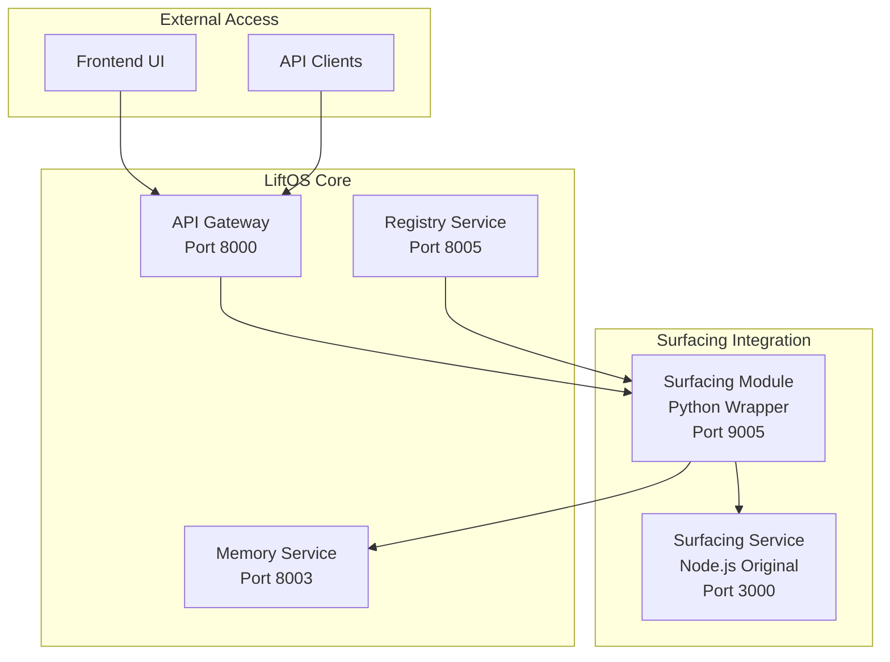

# 🌊 Surfacing Module Integration Guide

## Overview

The Surfacing module provides advanced product analysis and optimization capabilities for LiftOS Core. It integrates the existing Node.js surfacing microservice with the LiftOS ecosystem, providing seamless access through the unified API gateway and memory system.

## Architecture



## Components

### 1. Surfacing Service (Node.js)
- **Port**: 3000
- **Technology**: Node.js/Fastify
- **Purpose**: Original surfacing microservice with product analysis capabilities
- **Container**: `surfacing-service`

### 2. Surfacing Module (Python Wrapper)
- **Port**: 9005
- **Technology**: Python/FastAPI
- **Purpose**: LiftOS-compatible wrapper that integrates with memory and auth systems
- **Container**: `surfacing`

## Features

### Core Capabilities
- **Product Analysis**: Comprehensive analysis of product data and URLs
- **Batch Processing**: Analyze multiple products simultaneously
- **Optimization**: Product data optimization and enhancement
- **Memory Integration**: Stores and retrieves analysis results using KSE Memory
- **Hybrid Analysis**: Combines multiple AI approaches for better insights
- **Knowledge Graph**: Leverages knowledge graphs for contextual understanding

### API Endpoints

#### Module Information
```http
GET /api/v1/info
```
Returns module capabilities and configuration.

#### Product Analysis
```http
POST /api/v1/analyze
Content-Type: application/json

{
  "url": "https://example.com/product",
  "product_data": {
    "title": "Product Name",
    "description": "Product description",
    "price": "29.99"
  },
  "analysis_type": "comprehensive",
  "include_hybrid_analysis": true,
  "include_knowledge_graph": true,
  "optimization_level": "standard"
}
```

#### Batch Analysis
```http
POST /api/v1/batch-analyze
Content-Type: application/json

{
  "products": [
    {
      "id": "product1",
      "url": "https://example.com/product1",
      "productData": {...}
    },
    {
      "id": "product2", 
      "url": "https://example.com/product2",
      "productData": {...}
    }
  ],
  "analysis_id": "batch-001",
  "optimization_level": "advanced"
}
```

#### Product Optimization
```http
POST /api/v1/optimize
Content-Type: application/json

{
  "product_data": {
    "title": "Product to optimize",
    "description": "Current description",
    "features": ["feature1", "feature2"]
  },
  "optimization_level": "comprehensive"
}
```

#### Memory Search
```http
GET /api/v1/memory/search?query=product+analysis&search_type=hybrid
```

## Installation & Setup

### 1. Prerequisites
- LiftOS Core system running
- Docker and Docker Compose
- Access to the surfacing repository: `https://github.com/daleparr/Lift-os-surfacing`

### 2. Integration Steps

#### Step 1: Clone Surfacing Repository
```bash
# Clone the surfacing service repository
git clone https://github.com/daleparr/Lift-os-surfacing.git surfacing-service
```

#### Step 2: Build and Deploy
```bash
# For development
docker-compose -f docker-compose.yml -f docker-compose.dev.yml up surfacing-service surfacing

# For production
docker-compose -f docker-compose.production.yml up surfacing-service surfacing
```

#### Step 3: Register Module
```bash
# Register the surfacing module with the registry
python scripts/register_surfacing_module.py register

# Check registration status
python scripts/register_surfacing_module.py status
```

### 3. Environment Configuration

Add to your `.env` file:
```env
# Surfacing Service Configuration
SURFACING_SERVICE_URL=http://surfacing-service:3000
SURFACING_MODULE_URL=http://surfacing:9005
```

## Usage Examples

### Frontend Integration

```typescript
// React component example
import { useSurfacing } from '@/hooks/useSurfacing';

function ProductAnalyzer() {
  const { analyzeProduct, loading, result } = useSurfacing();
  
  const handleAnalyze = async (productUrl: string) => {
    const analysis = await analyzeProduct({
      url: productUrl,
      analysis_type: 'comprehensive',
      include_hybrid_analysis: true
    });
    
    console.log('Analysis result:', analysis);
  };
  
  return (
    <div>
      <input 
        type="url" 
        placeholder="Product URL"
        onSubmit={handleAnalyze}
      />
      {loading && <div>Analyzing...</div>}
      {result && <AnalysisResults data={result} />}
    </div>
  );
}
```

### API Client Example

```python
import httpx
import asyncio

async def analyze_product_example():
    async with httpx.AsyncClient() as client:
        # Authenticate first
        auth_response = await client.post(
            "http://localhost:8000/auth/login",
            json={"email": "user@example.com", "password": "password"}
        )
        
        token = auth_response.json()["access_token"]
        headers = {"Authorization": f"Bearer {token}"}
        
        # Analyze product
        analysis_response = await client.post(
            "http://localhost:8000/modules/surfacing/api/v1/analyze",
            json={
                "url": "https://example.com/product",
                "analysis_type": "comprehensive",
                "include_hybrid_analysis": True
            },
            headers=headers
        )
        
        result = analysis_response.json()
        print("Analysis completed:", result["data"]["correlation_id"])
        return result

# Run the example
asyncio.run(analyze_product_example())
```

### Memory Integration Example

```python
# Search for previous analyses
async def search_similar_products(query: str):
    async with httpx.AsyncClient() as client:
        response = await client.get(
            f"http://localhost:8000/modules/surfacing/api/v1/memory/search",
            params={"query": query, "search_type": "hybrid"},
            headers={"Authorization": f"Bearer {token}"}
        )
        
        return response.json()["data"]["results"]

# Find similar product analyses
similar = await search_similar_products("smartphone analysis")
```

## Monitoring & Health Checks

### Health Endpoints

```bash
# Check surfacing service health
curl http://localhost:3000/health

# Check surfacing module health  
curl http://localhost:9005/health

# Check through gateway
curl http://localhost:8000/modules/surfacing/health
```

### Monitoring Integration

The surfacing module integrates with LiftOS observability:

- **Metrics**: Exposed via `/metrics` endpoint
- **Logging**: Structured logs sent to centralized logging
- **Health Checks**: Kubernetes-ready health probes
- **Tracing**: Request correlation IDs for distributed tracing

## Configuration Options

### Module Configuration (`modules/surfacing/module.json`)

```json
{
  "configuration": {
    "surfacing_service_url": "http://surfacing-service:3000",
    "default_analysis_type": "comprehensive",
    "default_optimization_level": "standard", 
    "batch_size_limit": 100,
    "timeout_seconds": 60
  }
}
```

### Environment Variables

| Variable | Description | Default |
|----------|-------------|---------|
| `SURFACING_SERVICE_URL` | URL of the Node.js surfacing service | `http://surfacing-service:3000` |
| `MEMORY_SERVICE_URL` | URL of the memory service | `http://memory:8003` |
| `DEBUG` | Enable debug logging | `false` |

## Troubleshooting

### Common Issues

#### 1. Surfacing Service Unreachable
```bash
# Check if surfacing service is running
docker ps | grep surfacing-service

# Check logs
docker logs lift-surfacing-service

# Test direct connection
curl http://localhost:3000/health
```

#### 2. Module Not Registered
```bash
# Re-register the module
python scripts/register_surfacing_module.py register

# Check registry
curl http://localhost:8005/modules
```

#### 3. Memory Integration Issues
```bash
# Check memory service
curl http://localhost:8003/health

# Test memory search
curl -H "X-User-ID: test" -H "X-Org-ID: test" \
  http://localhost:8003/search \
  -d '{"query": "test", "search_type": "hybrid"}'
```

### Debug Mode

Enable debug logging:
```bash
# Set environment variable
export DEBUG=true

# Or in docker-compose
environment:
  - DEBUG=true
```

## Security Considerations

### Authentication
- All module endpoints require valid JWT tokens
- User context is automatically propagated from the gateway
- Role-based access control for different operations

### Data Privacy
- Analysis results are stored in organization-specific memory contexts
- No cross-organization data leakage
- Configurable data retention policies

### Network Security
- Internal service communication over private network
- No direct external access to surfacing service
- All traffic routed through authenticated gateway

## Performance Optimization

### Caching Strategy
- Analysis results cached in memory service
- Configurable TTL for different analysis types
- Intelligent cache invalidation

### Scaling
- Horizontal scaling of both surfacing service and module
- Load balancing through Docker Swarm or Kubernetes
- Async processing for batch operations

### Resource Limits
```yaml
# Docker resource limits
deploy:
  resources:
    limits:
      cpus: '2.0'
      memory: 2G
    reservations:
      cpus: '0.5'
      memory: 512M
```

## Development

### Local Development Setup

```bash
# Start development environment
docker-compose -f docker-compose.yml -f docker-compose.dev.yml up

# Watch logs
docker-compose logs -f surfacing surfacing-service

# Run tests
python -m pytest tests/test_surfacing_module.py
```

### Adding New Features

1. **Extend the Node.js service** for new analysis capabilities
2. **Update the Python wrapper** to expose new endpoints
3. **Update module.json** with new features and permissions
4. **Add tests** for new functionality
5. **Update documentation**

## Support

For issues and questions:
- **Documentation**: `/docs` endpoint on the module
- **Health Status**: `/health` endpoint
- **Logs**: Check container logs for detailed error information
- **Registry**: Check module registration status

## Changelog

### v1.0.0 (Current)
- Initial integration with LiftOS Core
- Product analysis and optimization capabilities
- Memory service integration
- Batch processing support
- Health monitoring and observability